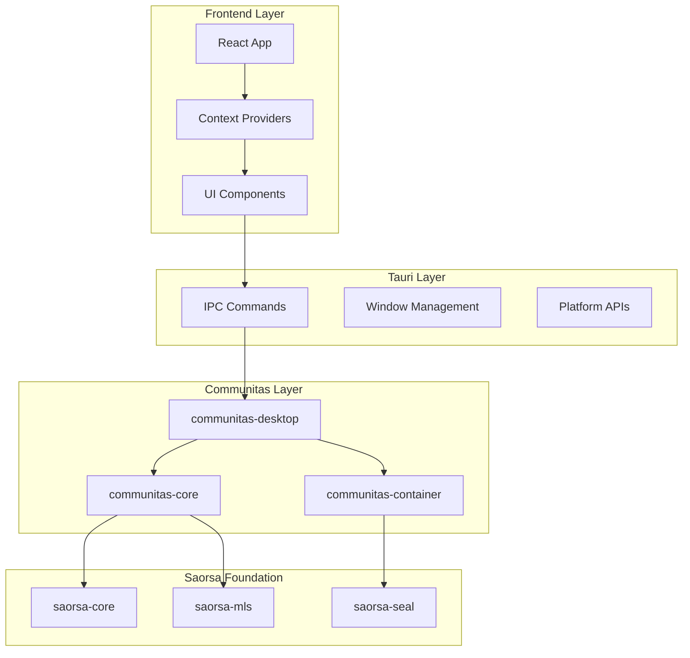

# Communitas — Technical Architecture

**Version**: 1.0 • **Date**: 2025-09-27 • **Scope**: Technical Implementation

This document defines the technical architecture, component interactions, and implementation patterns for the Communitas platform.

---

## **🏛️ System Architecture**

### **Layer Architecture**
```
┌─────────────────────────────────────────────────────────┐
│ Layer 4: User Interface (React + TypeScript)           │
│ ├─ Material-UI Components                               │
│ ├─ Context Providers (Auth, EntityDirectory, Storage)  │ 
│ └─ Real-time State Management                           │
├─────────────────────────────────────────────────────────┤
│ Layer 3: Application Logic (Communitas Rust Crates)    │
│ ├─ communitas-core: Business logic & saorsa-core glue  │
│ ├─ communitas-desktop: Tauri IPC commands              │
│ └─ communitas-container: Content operations            │
├─────────────────────────────────────────────────────────┤
│ Layer 2: Platform Integration (Tauri v2)               │
│ ├─ WebView Rendering                                    │
│ ├─ Native OS Integration                                │
│ └─ IPC Command Bridge                                   │
├─────────────────────────────────────────────────────────┤
│ Layer 1: Network Foundation (Saorsa-Core)              │
│ ├─ DHT Network (Kademlia)                               │
│ ├─ QUIC Transport (ant-quic)                            │
│ ├─ Post-Quantum Crypto (ML-DSA/ML-KEM)                 │
│ └─ Identity & Storage Management                        │
└─────────────────────────────────────────────────────────┘
```

### **Component Dependencies**


---

## **🔗 Four-Word Addressing Architecture**

### **Address Generation Pipeline**
```rust
// 1. Generate validated four-words
let four_words = generate_four_word_identity().await?;

// 2. Validate against dictionary
if !fw_check(words_array.clone()) {
    return Err("Invalid four-word identity");
}

// 3. Convert to entity key
let entity_key = fw_to_key(words_array)?;

// 4. Store entity metadata on DHT
dht_client.put_entity_record(&entity_key, &metadata).await?;
```

### **Discovery Architecture**
```
Four-Word Input → Dictionary Validation → Key Derivation → DHT Lookup → Entity Metadata
       ↓                   ↓                   ↓              ↓              ↓
User Types Words    saorsa-core Check    Hash to Key     Network Query   Display Info
Auto-Complete       Real-time Valid     Deterministic   Distributed     Local Cache
```

---

## **💾 Storage Architecture**

### **Virtual Disk System**
```rust
pub struct VirtualDisk {
    entity_id: EntityKey,        // Derived from four-words
    disk_type: DiskType,         // Private, Public, Shared
    content_store: ContentStore, // Content-addressed storage
    metadata: DiskMetadata,      // Access controls, policies
}

pub enum DiskType {
    Private,  // Individual access only
    Public,   // World-readable
    Shared,   // Group member access
}
```

### **Content Distribution**
```
Content → Chunking → Sealing → DHT Storage → Replication
   ↓         ↓          ↓          ↓            ↓
File/Data  Fixed Size  Encrypt   Distribute   Redundancy
User Data  Chunks      ML-KEM    P2P Network  Availability
```

---

## **🔐 Security Architecture**

### **Cryptographic Stack**
- **Signatures**: ML-DSA-65 for identity verification
- **Key Exchange**: ML-KEM-768 for session establishment  
- **Symmetric**: ChaCha20-Poly1305 for content encryption
- **Hashing**: BLAKE3 for content addressing and integrity

### **Trust Model**
```
Identity Verification → Endpoint Authentication → Message Encryption → Storage Sealing
        ↓                        ↓                       ↓                ↓
Four-Word Check         QUIC TLS Handshake      MLS Group Keys    saorsa-seal
Dictionary Valid        Certificate Chain       Perfect Forward   Threshold Crypto
```

### **Key Management**
```rust
pub struct KeyManagement {
    identity_keys: PlatformKeyring,    // ML-DSA keys
    session_keys: MemoryCache,         // Ephemeral keys  
    group_keys: GroupKeyStore,         // MLS group state
    storage_keys: NamespaceManager,    // Content encryption
}
```

---

## **🌐 Network Architecture**

### **P2P Network Topology**
```
Bootstrap Nodes → DHT Discovery → Peer Connection → Message Routing
       ↓               ↓              ↓                ↓
Known Endpoints   Find Neighbors    QUIC Channels    Encrypted Relay
Regional Seeds    Trust Weights     Direct P2P       Group Multicast
```

### **Connection Management**
- **Happy Eyeballs**: IPv4-first with IPv6 fallback
- **Connection Pooling**: Reuse QUIC connections efficiently
- **NAT Traversal**: STUN/TURN integration for peer discovery
- **Bandwidth Management**: QoS for voice/video prioritization

### **Address Resolution**
```rust
// User identity storage on DHT
pub struct UserIdentity {
    display_name: String,
    current_addresses: Vec<String>,  // Current four-word endpoints
    endpoints: Vec<NetworkEndpoint>, // IP addresses for direct connection
    public_key: PublicKey,           // ML-DSA verification key
    updated_at: SystemTime,
}
```

---

## **🔄 Event & State Architecture**

### **Event Flow**
```
User Action → Local Update → Background Sync → Event Broadcast → UI Update
     ↓            ↓             ↓               ↓               ↓
Click Send    Immediate UI   DHT Storage     Peer Notify    Live Update
Type Text     Optimistic     Network Ops     Real-time      State Sync
```

### **State Management Patterns**
- **React Context**: Global app state (auth, entities, network)
- **Local Storage**: Persistence for offline capabilities
- **Memory Cache**: Hot data for instant access
- **DHT Cache**: Network state with TTL policies

---

## **🚀 Deployment Architecture**

### **Desktop Distribution**
```
Frontend Build → Asset Bundling → Rust Compilation → Platform Binary → Code Signing
      ↓              ↓               ↓                 ↓             ↓
npm run build   Tauri Bundle    Cargo Release     Native App    Signature
Optimized JS    Asset Embed     Production        Platform      Verification
```

### **Network Infrastructure**
- **Bootstrap Nodes**: 6-region DigitalOcean deployment
- **Geographic Distribution**: Global presence for low latency
- **Auto-Update**: Cryptographically signed updates with jitter
- **Metrics**: Prometheus endpoints for network health monitoring

---

## **⚡ Performance Architecture**

### **Response Time Targets**
- **<50ms**: Local UI interactions, cache hits
- **<200ms**: Entity creation, four-word validation
- **<500ms**: DHT lookups, entity discovery
- **<1s**: Voice call setup, file operations
- **<5s**: Large file uploads, group synchronization

### **Scalability Design**
- **Horizontal**: P2P network scales with participants
- **Storage**: Content-addressed with automatic deduplication
- **Bandwidth**: Adaptive quality for voice/video calls
- **Memory**: LRU caching with configurable limits

---

This architecture provides the foundation for a secure, scalable, and user-friendly local-first collaboration platform.
