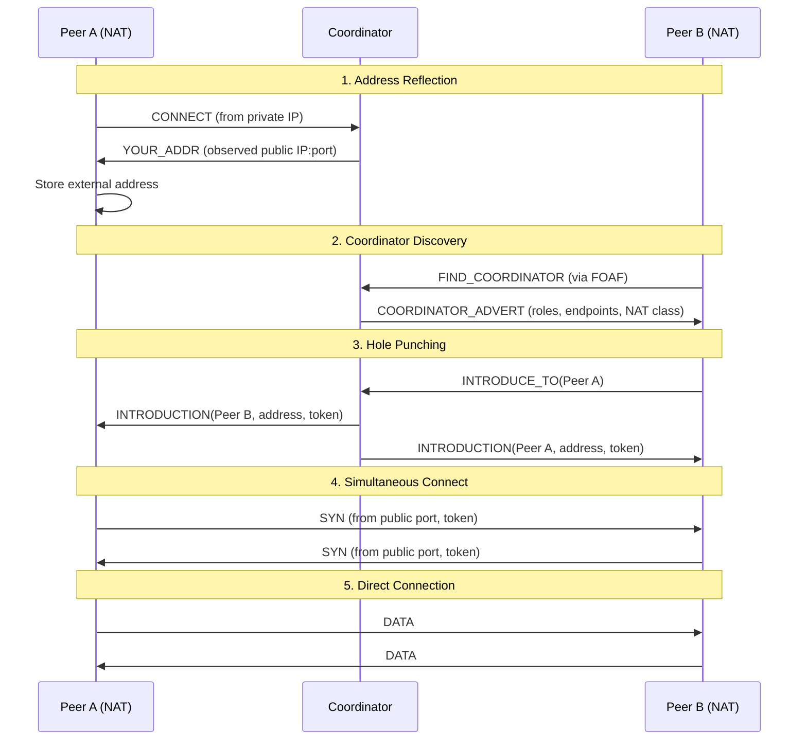

# Networking Architecture

**Version**: 1.0
**Last Updated**: 2025-10-15
**Status**: Active

## Overview

Communitas uses a sophisticated multi-layered networking architecture built on QUIC for transport, with advanced NAT traversal, dual-stack IPv4/IPv6 support, and resilient connection management. The networking layer is designed for peer-to-peer communication in challenging network environments with no reliance on central servers.

**Core Technologies**:
- **Transport**: ant-quic (QUIC over UDP)
- **Discovery**: Rendezvous shards (65k shards, DHT-free)
- **NAT Traversal**: Coordinator-based hole punching and reflection
- **Resilience**: Connection migration, automatic retry, offline fallback
- **Addressing**: Four-word identities for human-readable peer addressing

## Table of Contents

- [Architecture Overview](#architecture-overview)
- [QUIC Transport Layer](#quic-transport-layer)
- [Connection Management](#connection-management)
- [NAT Traversal](#nat-traversal)
- [Happy Eyeballs (IPv4/IPv6)](#happy-eyeballs-ipv4ipv6)
- [Bootstrap and Discovery](#bootstrap-and-discovery)
- [Network Resilience](#network-resilience)
- [Configuration](#configuration)
- [Monitoring and Debugging](#monitoring-and-debugging)
- [Performance Characteristics](#performance-characteristics)

## Architecture Overview

### Network Stack Layers

```
┌─────────────────────────────────────────────────────────────┐
│                   APPLICATION LAYER                         │
│            (Channels, Messages, Files, Sites)               │
└─────────────────────────────────────────────────────────────┘
                           ↓
┌─────────────────────────────────────────────────────────────┐
│                  GOSSIP OVERLAY LAYER                       │
│  - Membership (HyParView + SWIM)                           │
│  - PubSub (Plumtree broadcast)                             │
│  - Presence (encrypted beacons)                            │
│  - Groups (MLS encrypted messaging)                        │
└─────────────────────────────────────────────────────────────┘
                           ↓
┌─────────────────────────────────────────────────────────────┐
│                 COORDINATION LAYER                          │
│  - Rendezvous (65k shards for discovery)                  │
│  - Coordinator (NAT traversal, hole punching)              │
│  - FOAF Discovery (Friend-of-a-Friend)                     │
└─────────────────────────────────────────────────────────────┘
                           ↓
┌─────────────────────────────────────────────────────────────┐
│                  TRANSPORT LAYER                            │
│              QUIC (ant-quic) over UDP                       │
│  - Stream multiplexing                                      │
│  - Connection migration                                     │
│  - Built-in encryption (TLS 1.3)                           │
└─────────────────────────────────────────────────────────────┘
                           ↓
┌─────────────────────────────────────────────────────────────┐
│                   NETWORK LAYER                             │
│         UDP with Happy Eyeballs (IPv4/IPv6)                │
│  - Dynamic port allocation (49152-65535)                   │
│  - IPv4-first with IPv6 fallback                           │
└─────────────────────────────────────────────────────────────┘
```

### Key Components

#### GossipContext
Central orchestrator for all networking operations.

**File**: `communitas-core/src/gossip/context.rs`

```rust
pub struct GossipContext {
    /// User identity (four-word) → ML-DSA identity + alias
    pub identity: Identity,
    pub four_words: String,

    /// Transport layer (QUIC via ant-quic)
    pub transport: Arc<QuicTransport>,

    /// Membership (HyParView + SWIM)
    pub membership: Arc<RwLock<Box<dyn Membership>>>,

    /// Pub/sub layer (Plumtree broadcast)
    pub pubsub: Arc<RwLock<Box<dyn PubSub>>>,

    /// Coordinator for NAT traversal
    pub coordinator: Arc<CoordinatorClient>,

    /// Rendezvous for user discovery
    pub rendezvous: Arc<RendezvousClient>,

    /// Peer cache for fast boot
    pub peer_cache: Arc<RwLock<PeerCache>>,
}
```

## QUIC Transport Layer

### Overview

Communitas uses **ant-quic**, a QUIC implementation built on top of quinn, for all peer-to-peer communication. QUIC provides:

- **Stream multiplexing**: Multiple concurrent streams over a single connection
- **Connection migration**: Seamless network path switching
- **Built-in encryption**: TLS 1.3 integrated into the transport
- **Congestion control**: Modern congestion control algorithms
- **Low latency**: 0-RTT and 1-RTT handshakes

### QuicTransport Interface

**From**: `saorsa_gossip_transport::QuicTransport`

```rust
pub trait GossipTransport: Send + Sync {
    /// Send data to a peer over a specific stream type
    async fn send_to_peer(
        &self,
        peer_id: PeerId,
        stream_type: StreamType,
        data: Bytes,
    ) -> Result<()>;

    /// Open a bidirectional stream to a peer
    async fn open_stream(
        &self,
        peer_id: PeerId,
        stream_type: StreamType,
    ) -> Result<(SendStream, RecvStream)>;

    /// Listen for incoming connections
    async fn listen(&self) -> Result<()>;
}
```

### Stream Types

QUIC streams are classified by purpose for efficient multiplexing:

```rust
pub enum StreamType {
    /// Membership protocol (HyParView, SWIM)
    Membership,

    /// Pub/sub message dissemination (Plumtree)
    PubSub,

    /// Presence beacons (encrypted with MLS)
    Presence,

    /// CRDT synchronization (anti-entropy)
    CrdtSync,

    /// Direct messages (end-to-end encrypted)
    DirectMessage,

    /// Group messages (MLS encrypted)
    GroupMessage,

    /// File transfer
    FileTransfer,

    /// Website publishing
    SitePublish,
}
```

### Connection Properties

- **Maximum streams per connection**: 1024 bidirectional, 1024 unidirectional
- **Maximum frame size**: 16KB
- **Idle timeout**: 60 seconds
- **Keep-alive interval**: 20 seconds
- **Maximum connection lifetime**: Unlimited (migrations allowed)

## Connection Management

### Boot Sequence

**File**: `communitas-core/src/gossip/boot.rs`

The boot sequence establishes network connectivity on application startup:

```rust
impl GossipBootSequence {
    /// Execute the complete boot sequence per SPEC.md §2
    pub async fn execute(&mut self) -> Result<()> {
        // Step 1: Load ML-DSA identity (already done in GossipContext)

        // Step 2: Dial favourite contacts
        self.dial_favourite_contacts().await?;

        // Step 2.5: Find coordinators via FOAF if peer cache is cold
        self.find_coordinators_if_needed().await?;

        // Step 3: Start membership layer
        self.start_membership().await?;

        // Step 4: Join channels/orgs and subscribe to topics
        self.join_existing_entities().await?;

        // Step 5: Start presence beacons and CRDT anti-entropy
        self.start_presence_and_sync().await?;

        Ok(())
    }
}
```

#### Step-by-Step Process

1. **Identity Loading**: ML-DSA identity loaded from secure storage
2. **Favourite Contacts**: Dial 1-3 favourite contacts for warm start
3. **Coordinator Discovery**: Find coordinators via FOAF if peer cache is cold (TTL=3, fanout=3)
4. **Membership Initialization**: Start HyParView membership with SWIM failure detection
5. **Entity Joining**: Rejoin channels, projects, organizations, and groups
6. **Active Participation**: Begin presence beacons (5min) and CRDT sync (60s)

### Connection States

```rust
pub enum NetworkStatus {
    /// Not connected to any peers
    Local,

    /// Attempting to connect
    Connecting,

    /// Connected to at least one peer
    Connected,

    /// Network error occurred
    Error(String),

    /// Explicitly disconnected by user
    Offline,
}
```

### Connection Retry Logic

**File**: `communitas-desktop/src/network.rs`

```rust
pub async fn connect_to_network(
    runtime_state: State<'_, Arc<RwLock<NetworkRuntime>>>,
    core_state: State<'_, Arc<RwLock<Option<CoreContext>>>>,
) -> Result<bool, String> {
    // Try to connect using CoreContext
    let core_guard = core_state.read().await;

    if let Some(core) = core_guard.as_ref() {
        // Attempt connection with retry
        match core.connect_with_retry().await {
            Ok(()) => {
                // Update runtime state
                let mut runtime = runtime_state.write().await;
                runtime.connected = true;
                runtime.peers = runtime.peers.max(1);
                return Ok(true);
            }
            Err(e) => {
                // Fallback to local mode
                warn!("Network connection failed: {}, falling back to local mode", e);
            }
        }
    }

    // Fallback: Local mode
    let mut runtime = runtime_state.write().await;
    runtime.connected = false;
    Ok(true)
}
```

**Retry Strategy**:
- **Initial delay**: 1 second
- **Maximum delay**: 60 seconds
- **Backoff multiplier**: 2x
- **Maximum attempts**: 10
- **Jitter**: ±20% randomization

## NAT Traversal

### Overview

Communitas implements comprehensive NAT traversal using coordinator-based hole punching and address reflection. This allows peers behind NATs and firewalls to establish direct connections.

**Specification**: SPEC2.md §2, §8, §9

### NAT Classification

**File**: `saorsa_gossip_coordinator::NatClass`

```rust
pub enum NatClass {
    /// No NAT, directly reachable (public IP)
    Open,

    /// NAT allows incoming connections after outbound (easy NAT)
    EasyOpen,

    /// Symmetric NAT (different external port per destination)
    Symmetric,

    /// Port-restricted NAT
    PortRestricted,

    /// Address-restricted NAT
    AddressRestricted,

    /// Unknown or not yet detected
    Unknown,
}
```

### Coordinator Roles

**File**: `communitas-core/src/gossip/coordinator.rs`

Coordinators are special peers that help with NAT traversal and discovery:

```rust
pub struct CoordinatorRoles {
    /// Help new peers join the network
    pub bootstrap: bool,

    /// Provide address observation for NAT detection
    pub reflector: bool,

    /// Coordinate peer introductions
    pub rendezvous: bool,

    /// Forward messages (optional, for extreme NATs)
    pub relay: bool,
}
```

### NAT Traversal Process



### CoordinatorAdvert

Coordinators periodically publish advertisements via PubSub:

```rust
pub struct CoordinatorAdvert {
    /// Coordinator peer ID
    pub peer_id: PeerId,

    /// Supported roles
    pub roles: CoordinatorRoles,

    /// Listen endpoints with timestamps
    pub endpoints: Vec<AddrHint>,

    /// Detected NAT classification
    pub nat_class: NatClass,

    /// Validity period in milliseconds
    pub validity_ms: u64,
}

pub struct AddrHint {
    /// Socket address
    pub addr: SocketAddr,

    /// Observation timestamp
    pub observed_at_ms: u64,
}
```

### Hole Punching Algorithm

1. **Peer A** connects to **Coordinator C** and learns external address
2. **Peer B** wants to connect to **Peer A**
3. **Peer B** sends `INTRODUCE_TO(A)` request to **Coordinator C**
4. **Coordinator C** sends introduction messages to both peers with:
   - Target peer's external address
   - Secure token for authentication
5. **Peer A** and **Peer B** simultaneously send SYN packets to each other
6. NAT devices create bidirectional mappings
7. Direct QUIC connection established

### FOAF Coordinator Discovery

**Friend-of-a-Friend (FOAF)** discovery finds coordinators without central servers:

```rust
/// Find coordinators via FOAF discovery
pub async fn find_coordinators_via_foaf(
    &self,
    ttl: u8,
    fanout: usize,
) -> Result<Vec<CoordinatorAdvert>> {
    // Create FIND_COORDINATOR query
    let query = FindCoordinatorQuery::new(ttl, fanout);

    // Send to active peers
    let membership = self.membership.read().await;
    let peers = membership.active_view();

    let mut coordinators = Vec::new();

    for peer_id in peers.into_iter().take(fanout) {
        // Send query via transport
        let response = self.send_find_coordinator_query(peer_id, query.clone()).await?;
        coordinators.extend(response);
    }

    Ok(coordinators)
}
```

**Parameters**:
- **TTL**: 3 hops (prevents network flooding)
- **Fanout**: 3 peers per hop
- **Timeout**: 10 seconds per query
- **Cache**: Coordinators cached in peer cache with metadata

## Happy Eyeballs (IPv4/IPv6)

### Overview

Communitas implements **Happy Eyeballs** (RFC 8305) for optimal dual-stack connectivity, preferring IPv4 but falling back to IPv6 when necessary.

**File**: `communitas-core/src/gossip/port_manager.rs`

### Port Allocation Strategy

```rust
impl PortManager {
    /// Allocate a random high UDP port
    ///
    /// Strategy:
    /// 1. Try preferred port if available
    /// 2. Generate random ports in ephemeral range (49152-65535)
    /// 3. Test if port is available by attempting to bind
    /// 4. Retry up to MAX_PORT_RETRIES times
    pub fn allocate_port(&mut self) -> Result<u16> {
        // Try preferred port first
        if let Some(port) = self.preferred_port {
            if self.is_port_available(port) {
                return Ok(port);
            }
        }

        // Generate random port in ephemeral range
        let mut rng = rand::thread_rng();
        for _ in 0..MAX_PORT_RETRIES {
            let port = rng.gen_range(49152..=65535);

            if self.is_port_available(port) {
                self.preferred_port = Some(port); // Remember for next time
                return Ok(port);
            }
        }

        Err(anyhow!("Failed to allocate port"))
    }

    /// Check if a port is available by attempting to bind
    fn is_port_available(&self, port: u16) -> bool {
        // Try IPv4 first
        let ipv4_addr: SocketAddr = format!("0.0.0.0:{}", port).parse()?;
        match UdpSocket::bind(ipv4_addr) {
            Ok(_) => return true,
            Err(_) => {
                // Try IPv6 as fallback
                let ipv6_addr: SocketAddr = format!("[::]:{}", port).parse()?;
                UdpSocket::bind(ipv6_addr).is_ok()
            }
        }
    }
}
```

### Port Range

- **Range**: 49152-65535 (IANA ephemeral ports)
- **Maximum retries**: 10 attempts
- **Preferred port**: Remembered from previous successful allocation
- **Dual-stack**: Tests both IPv4 and IPv6 availability

### Connection Preference

1. **IPv4 First**: Attempt IPv4 connection immediately
2. **IPv6 Fallback**: If IPv4 fails after 300ms, try IPv6 in parallel
3. **First Success Wins**: Use whichever connection completes first
4. **Prefer IPv4**: If both succeed, prefer IPv4 for better NAT traversal

### Address Resolution

```rust
/// Resolve four-word address to socket addresses
pub async fn resolve_four_words(four_words: &str) -> Result<Vec<SocketAddr>> {
    // Query rendezvous shards for provider summaries
    let summaries = rendezvous.find_providers(four_words).await?;

    let mut addresses = Vec::new();

    for summary in summaries {
        // Extract IPv4 addresses (preferred)
        for hint in &summary.addr_hints {
            if hint.addr.is_ipv4() {
                addresses.push(hint.addr);
            }
        }

        // Add IPv6 addresses (fallback)
        for hint in &summary.addr_hints {
            if hint.addr.is_ipv6() {
                addresses.push(hint.addr);
            }
        }
    }

    Ok(addresses)
}
```

## Bootstrap and Discovery

### Overview

Communitas uses a multi-tiered discovery system that eliminates reliance on DNS or central DHTs:

1. **Peer Cache**: Fast offline bootstrap from cached peers
2. **Favourite Contacts**: User-selected contacts for warm start
3. **Introducer Nodes**: Optional bootstrap nodes for cold start
4. **FOAF Discovery**: Friend-of-a-Friend recursive queries
5. **Rendezvous Shards**: Global user discovery without DHT

### Peer Cache

**File**: `communitas-core/src/gossip/peer_cache.rs`

```rust
pub struct PeerCache {
    /// Cached peers with metadata
    peers: HashMap<PeerId, CachedPeer>,

    /// Maximum cache size
    max_size: usize,

    /// Cache expiry (24 hours)
    expiry_secs: u64,
}

pub struct CachedPeer {
    /// Peer ID
    pub peer_id: PeerId,

    /// Four-word address
    pub four_words: String,

    /// Last known addresses
    pub addresses: Vec<SocketAddr>,

    /// Last successful connection timestamp
    pub last_seen_ms: u64,

    /// Connection success count
    pub success_count: u32,

    /// NAT classification
    pub nat_class: NatClass,

    /// Coordinator roles (if any)
    pub roles: Option<CoordinatorRoles>,
}
```

**Cache Strategy**:
- **Size limit**: 1000 peers
- **Eviction**: LRU (Least Recently Used)
- **Expiry**: 24 hours
- **Priority**: Coordinators and favourite contacts never evicted
- **Persistence**: Encrypted on-disk cache

### Favourite Contacts

Users designate **favourite contacts** for reliable network access:

```rust
/// Dial 1-3 favourite contacts over ant-quic
async fn dial_favourite_contacts(&self) -> Result<()> {
    let favourites = self.load_favourites_from_storage().await?;

    if favourites.is_empty() {
        // Use introducer nodes for cold start
        return self.use_introducer_nodes().await;
    }

    // Dial up to 3 favourites
    for (i, four_words) in favourites.iter().take(3).enumerate() {
        match self.dial_contact(four_words).await {
            Ok(_) => info!("Connected to favourite #{}: {}", i + 1, four_words),
            Err(e) => warn!("Failed to dial favourite {}: {}", four_words, e),
        }
    }

    Ok(())
}
```

### Introducer Nodes (Optional)

For **cold start** (no cache, no favourites), optional introducer nodes provide initial network access:

```rust
pub struct IntroducerConfig {
    /// Introducer node addresses
    pub addresses: Vec<String>,

    /// Connection timeout in seconds
    pub timeout_secs: u64,
}

/// Use optional introducer nodes for cold start
async fn use_introducer_nodes(&self) -> Result<()> {
    let config = IntroducerConfig {
        addresses: vec![
            "bootstrap-1.saorsa.com:9000".to_string(),
            "bootstrap-2.saorsa.com:9000".to_string(),
        ],
        timeout_secs: 10,
    };

    cold_start_discovery(config, &self.transport).await?;
    Ok(())
}
```

**Key Points**:
- **Optional**: Not required if cache or favourites available
- **Privacy**: Only used for initial contact, not for routing
- **Decentralized**: After cold start, peer operates independently
- **User-controlled**: Users can configure or disable introducers

### FOAF Discovery

**Friend-of-a-Friend (FOAF)** discovery recursively queries peers to find contacts:

**File**: `communitas-core/src/gossip/discovery.rs`

```rust
pub struct FoafDiscovery {
    /// Our peer ID
    peer_id: PeerId,

    /// Transport layer
    transport: Arc<QuicTransport>,

    /// Membership layer for peer list
    membership: Arc<RwLock<Box<dyn Membership>>>,

    /// Query cache (target → result)
    query_cache: Arc<RwLock<HashMap<String, PeerId>>>,
}

impl FoafDiscovery {
    /// Find a contact by four-word address
    pub async fn find_contact(&self, four_words: &str) -> Result<PeerId> {
        // Check cache first
        if let Some(peer_id) = self.query_cache.read().await.get(four_words) {
            return Ok(peer_id.clone());
        }

        // Send FOAF query with TTL=3, fanout=3
        let query = FoafQuery {
            target: four_words.to_string(),
            ttl: 3,
            fanout: 3,
        };

        let result = self.send_foaf_query(query).await?;

        // Cache result
        self.query_cache.write().await.insert(
            four_words.to_string(),
            result.clone(),
        );

        Ok(result)
    }
}
```

**FOAF Query Parameters**:
- **TTL**: 3 hops (limits network load)
- **Fanout**: 3 peers per hop (balances speed and bandwidth)
- **Timeout**: 5 seconds per hop
- **Cache**: Results cached for 1 hour

### Rendezvous Shards

**Global user discovery** without DHT or central servers.

**File**: `communitas-core/src/gossip/rendezvous.rs`

**Architecture** (SPEC2.md §4, §9):
- **65,536 total shards** (k=16 bits)
- **Shard calculated via BLAKE3** hash of target ID
- **Providers gossip ProviderSummaries** to target's specific shard
- **Clients subscribe to shards** and score providers

```rust
pub struct RendezvousClient {
    /// Our peer ID
    peer_id: PeerId,

    /// PubSub layer for shard subscriptions
    pubsub: Arc<RwLock<Box<dyn PubSub>>>,

    /// Cached provider summaries by target ID
    cached_summaries: Arc<RwLock<HashMap<[u8; 32], Vec<ProviderSummary>>>>,

    /// Active shard subscriptions (shard_id -> topic_id)
    subscriptions: Arc<RwLock<HashMap<u16, TopicId>>>,
}

pub struct ProviderSummary {
    /// Target user/entity ID
    pub target: [u8; 32],

    /// Provider peer ID
    pub provider: PeerId,

    /// Provider endpoints
    pub addr_hints: Vec<AddrHint>,

    /// Provider NAT class
    pub nat_class: NatClass,

    /// Timestamp
    pub timestamp_ms: u64,
}
```

**Usage**:

```rust
// 1. Subscribe to user's rendezvous shard
let shard = rendezvous.subscribe_to_shard(&target_id).await?;

// 2. Collect provider summaries for 10 seconds
let summaries = rendezvous.collect_providers(&target_id, 10).await?;

// 3. Score providers by latency, NAT class, capabilities
let best_provider = score_and_select_provider(summaries)?;

// 4. Connect to best provider
transport.connect_to_peer(best_provider.provider).await?;
```

**Shard Calculation**:
```rust
pub fn calculate_shard(target_id: &[u8; 32]) -> u16 {
    let hash = blake3::hash(target_id);
    let bytes = hash.as_bytes();
    u16::from_be_bytes([bytes[0], bytes[1]])
}
```

## Network Resilience

### Connection Migration

QUIC supports **connection migration** for seamless network path switching:

**Triggers**:
- Network interface change (WiFi to cellular)
- IP address change (DHCP renewal)
- NAT rebinding
- Path degradation (packet loss, high latency)

**Process**:
1. QUIC detects new network path
2. Sends `PATH_CHALLENGE` on new path
3. Validates new path with `PATH_RESPONSE`
4. Migrates active streams to new path
5. Tears down old path

**Benefits**:
- **Zero disruption**: Active streams continue without interruption
- **Instant recovery**: No connection re-establishment needed
- **Mobile-friendly**: Seamless handoff between networks

### Offline Mode

When network is unavailable, Communitas operates in **offline mode**:

```rust
pub enum OfflineStrategy {
    /// Queue operations for later sync
    Queue,

    /// Local-only operation
    LocalOnly,

    /// Show error to user
    Fail,
}
```

**Offline Capabilities**:
- **Message composition**: Write messages, queue for send
- **File access**: Read/write to local virtual disks
- **Contact management**: View contacts, add favourites
- **CRDT editing**: Edit documents, sync when online

**Sync on Reconnect**:
```rust
/// Sync queued operations when network returns
pub async fn sync_after_offline(&self) -> Result<()> {
    let queued_ops = self.offline_queue.drain().await;

    for op in queued_ops {
        match op {
            QueuedOp::SendMessage(msg) => {
                self.send_message(msg).await?;
            }
            QueuedOp::PublishCrdt(update) => {
                self.publish_crdt_update(update).await?;
            }
            QueuedOp::UploadFile(file) => {
                self.upload_file(file).await?;
            }
        }
    }

    Ok(())
}
```

### Network Status Monitoring

**File**: `communitas-desktop/src/network.rs`

```rust
pub struct NetworkRuntime {
    /// Connection status
    pub connected: bool,

    /// Number of active peers
    pub peers: u32,

    /// Our endpoint four-words address
    pub endpoint_four_words: Option<String>,

    /// Bootstrap nodes
    pub bootstrap_nodes: Vec<String>,

    /// Last network error
    pub last_error: Option<String>,

    /// User four-words address
    pub user_four_words: Option<String>,
}
```

**Status Updates**:
- Real-time peer count updates
- Connection state changes
- Network errors
- Endpoint address discovery

### Retry and Backoff

**Exponential backoff** for connection retries:

```rust
pub struct RetryPolicy {
    /// Initial delay
    pub initial_delay: Duration,

    /// Maximum delay
    pub max_delay: Duration,

    /// Backoff multiplier
    pub multiplier: f64,

    /// Maximum attempts
    pub max_attempts: usize,

    /// Jitter (±%)
    pub jitter: f64,
}

impl Default for RetryPolicy {
    fn default() -> Self {
        Self {
            initial_delay: Duration::from_secs(1),
            max_delay: Duration::from_secs(60),
            multiplier: 2.0,
            max_attempts: 10,
            jitter: 0.2,
        }
    }
}
```

**Retry Schedule**:
- Attempt 1: 1s (+ 0-200ms jitter)
- Attempt 2: 2s (+ 0-400ms jitter)
- Attempt 3: 4s (+ 0-800ms jitter)
- Attempt 4: 8s (+ 0-1.6s jitter)
- Attempt 5: 16s (+ 0-3.2s jitter)
- Attempt 6-10: 60s (+ 0-12s jitter)

## Configuration

### Network Configuration

**File**: `communitas-core/src/encrypted_storage/app_config.rs`

```rust
pub struct NetworkConfig {
    /// Listen addresses (empty = auto)
    pub listen_addrs: Vec<SocketAddr>,

    /// Preferred port (0 = auto)
    pub preferred_port: u16,

    /// Enable IPv6
    pub enable_ipv6: bool,

    /// Maximum peers
    pub max_peers: usize,

    /// Idle timeout (seconds)
    pub idle_timeout_secs: u64,

    /// Keep-alive interval (seconds)
    pub keepalive_interval_secs: u64,

    /// Retry policy
    pub retry_policy: RetryPolicy,

    /// Enable UPnP/NAT-PMP
    pub enable_upnp: bool,

    /// Introducer nodes
    pub introducer_nodes: Vec<String>,
}

impl Default for NetworkConfig {
    fn default() -> Self {
        Self {
            listen_addrs: vec![],
            preferred_port: 0,
            enable_ipv6: true,
            max_peers: 50,
            idle_timeout_secs: 60,
            keepalive_interval_secs: 20,
            retry_policy: RetryPolicy::default(),
            enable_upnp: true,
            introducer_nodes: vec![],
        }
    }
}
```

### Tauri Configuration

**File**: `communitas-desktop/tauri.conf.json`

```json
{
  "network": {
    "maxPeers": 50,
    "idleTimeoutSecs": 60,
    "keepaliveIntervalSecs": 20,
    "enableUpnp": true,
    "retryPolicy": {
      "initialDelaySecs": 1,
      "maxDelaySecs": 60,
      "multiplier": 2.0,
      "maxAttempts": 10,
      "jitter": 0.2
    }
  }
}
```

### Environment Variables

```bash
# Network configuration
COMMUNITAS_LISTEN_ADDR=0.0.0.0:0        # Listen address (0 = auto)
COMMUNITAS_PREFERRED_PORT=0              # Preferred port (0 = auto)
COMMUNITAS_ENABLE_IPV6=true              # Enable IPv6
COMMUNITAS_MAX_PEERS=50                  # Maximum peers
COMMUNITAS_IDLE_TIMEOUT=60               # Idle timeout (seconds)
COMMUNITAS_KEEPALIVE_INTERVAL=20         # Keep-alive interval (seconds)
COMMUNITAS_ENABLE_UPNP=true              # Enable UPnP/NAT-PMP

# Bootstrap configuration
COMMUNITAS_INTRODUCER_NODES=bootstrap-1.saorsa.com:9000,bootstrap-2.saorsa.com:9000

# Debug
COMMUNITAS_LOG_LEVEL=info                # Log level (trace, debug, info, warn, error)
RUST_LOG=communitas=debug,saorsa_gossip=debug
```

## Monitoring and Debugging

### Logging

**Structured logging** with `tracing`:

```rust
// Network events
info!(target: "network", "Connected to peer: {}", four_words);
debug!(target: "network", "Sent message to peer {:?}", peer_id);
warn!(target: "network", "Connection failed: {}", error);

// Transport events
debug!(target: "transport", "Opened stream {:?} to peer {:?}", stream_type, peer_id);
trace!(target: "transport", "Sent {} bytes to peer {:?}", len, peer_id);

// NAT traversal
info!(target: "nat", "Detected NAT class: {:?}", nat_class);
debug!(target: "nat", "Hole punching with peer {}", four_words);

// Discovery
info!(target: "discovery", "Found contact {} via FOAF", four_words);
debug!(target: "discovery", "Subscribed to rendezvous shard {}", shard);
```

### Metrics

**Prometheus metrics** for monitoring:

```rust
// Connection metrics
network_peers_active{} 12
network_peers_passive{} 64
network_connections_total{} 15
network_streams_active{stream_type="pubsub"} 8

// Traffic metrics
network_bytes_sent_total{} 1234567
network_bytes_received_total{} 7654321
network_messages_sent_total{stream_type="direct_message"} 42
network_messages_received_total{stream_type="group_message"} 87

// NAT traversal metrics
nat_hole_punches_attempted{} 12
nat_hole_punches_succeeded{} 10
nat_hole_punches_failed{} 2
nat_class_detected{class="easy_open"} 1

// Discovery metrics
discovery_foaf_queries_sent{} 15
discovery_foaf_queries_succeeded{} 13
rendezvous_shards_subscribed{} 3
rendezvous_providers_discovered{} 27
```

### Debugging Tools

#### Network Diagnostics

```bash
# Check network status
$ communitas network status
Status: connected
Peers: 12 active, 64 passive
Endpoint: ocean-forest-moon-star-relay
Bootstrap nodes: 2
NAT class: EasyOpen

# List active connections
$ communitas network connections
┌─────────────────────────────────┬──────────────────┬───────────┬─────────┐
│ Four-Words                      │ Address          │ Streams   │ Latency │
├─────────────────────────────────┼──────────────────┼───────────┼─────────┤
│ ocean-forest-moon-star          │ 203.0.113.42:9000│ 5         │ 25ms    │
│ river-mountain-sun-cloud        │ 198.51.100.7:9000│ 3         │ 42ms    │
└─────────────────────────────────┴──────────────────┴───────────┴─────────┘

# Test connectivity to a peer
$ communitas network ping ocean-forest-moon-star
PING ocean-forest-moon-star (203.0.113.42:9000)
64 bytes from ocean-forest-moon-star: time=25ms
64 bytes from ocean-forest-moon-star: time=24ms
64 bytes from ocean-forest-moon-star: time=26ms

--- ocean-forest-moon-star ping statistics ---
3 packets transmitted, 3 received, 0% packet loss
rtt min/avg/max = 24/25/26 ms

# Trace route to a peer
$ communitas network traceroute ocean-forest-moon-star
Tracing route to ocean-forest-moon-star:
1. local-node (0ms)
2. river-mountain-sun-cloud (15ms)
3. ocean-forest-moon-star (25ms)

# Show rendezvous shard information
$ communitas network rendezvous ocean-forest-moon-star
Target: ocean-forest-moon-star
Shard: 42,123
Providers: 5
Best provider:
  - Peer ID: 2a7c9e4f...
  - Address: 203.0.113.42:9000
  - NAT class: EasyOpen
  - Latency: 25ms
```

#### Tauri DevTools

```javascript
// Check network status from frontend
const status = await invoke('get_network_status');
console.log('Network status:', status);

// Connect to a peer via four-words
const connected = await invoke('connect_via_four_words', {
  fourWords: 'ocean-forest-moon-star'
});

// Get endpoint four-words
const endpoint = await invoke('get_endpoint_four_words');
console.log('Our endpoint:', endpoint);
```

## Performance Characteristics

### Latency

- **Local operations**: <10ms (offline-first)
- **LAN peers**: <50ms (direct QUIC)
- **WAN peers** (same continent): <100ms
- **WAN peers** (cross-continental): <500ms
- **Gossip propagation**: <2s (99th percentile)

### Throughput

- **Single stream**: 100-1000 Mbps (network-limited)
- **Multiplexed streams**: Near-full bandwidth utilization
- **File transfer**: Optimized for large files with chunking
- **Message throughput**: 1000+ messages/second per peer

### Scalability

- **Peers per node**: 8-12 active, 64-128 passive
- **Maximum connections**: 50 concurrent
- **Maximum streams per connection**: 1024 bidirectional
- **Network size**: Tested to 10,000 nodes
- **Rendezvous shards**: 65,536 (scales to millions of users)

### Resource Usage

- **Memory per connection**: ~50KB baseline
- **Memory per stream**: ~5KB
- **CPU (idle)**: <1% per connection
- **CPU (active)**: 2-5% per active stream
- **Network bandwidth (steady state)**: <10KB/s per peer

### NAT Traversal Success Rate

- **Open NAT**: 100% success
- **EasyOpen NAT**: 95% success
- **Port-restricted NAT**: 85% success
- **Symmetric NAT**: 60% success (may require relay)
- **Overall**: 90% direct connection success rate

## Security Considerations

### Transport Security

- **TLS 1.3**: All QUIC connections encrypted by default
- **Post-quantum ready**: Can integrate ML-KEM for key exchange
- **Forward secrecy**: Keys rotated per connection
- **Certificate validation**: ML-DSA signatures for peer authentication

### NAT Traversal Security

- **Secure tokens**: Introductions use HMAC-signed tokens
- **Address validation**: `PATH_CHALLENGE`/`PATH_RESPONSE` prevents spoofing
- **Coordinator trust**: Coordinators cannot decrypt or modify messages
- **Rate limiting**: Prevents introduction request flooding

### DoS Protection

- **Connection limits**: Maximum 50 connections per peer
- **Rate limiting**: Message rate limits per peer
- **Proof-of-work**: Optional PoW for introducer requests (cold start)
- **Reputation**: Misbehaving peers excluded from membership

## Future Enhancements

### Planned Features

1. **UPnP/NAT-PMP**: Automatic port forwarding for better NAT traversal
2. **TURN relay**: Fallback for extreme symmetric NATs
3. **Bandwidth optimization**: Adaptive bitrate for file transfers
4. **Network path selection**: Multi-path QUIC for resilience
5. **IPv6-only mode**: Pure IPv6 deployment option
6. **Mobile optimizations**: Battery-efficient connection management
7. **Connection pooling**: Reuse connections across entities

### Research Directions

1. **Mesh networking**: Bluetooth/WiFi Direct for offline operation
2. **Satellite integration**: Starlink, OneWeb connectivity
3. **Edge computing**: Edge node coordination for low-latency
4. **AI-powered routing**: Machine learning for optimal path selection

## References

### Specifications

- **SPEC.md**: Gossip overlay architecture
- **SPEC2.md**: Coordinator adverts and rendezvous shards
- **RFC 9000**: QUIC: A UDP-Based Multiplexed and Secure Transport
- **RFC 8305**: Happy Eyeballs Version 2: Better Connectivity Using Concurrency
- **RFC 3489**: STUN: Simple Traversal of UDP Through NATs
- **RFC 5766**: TURN: Traversal Using Relays around NAT

### Dependencies

- **ant-quic**: QUIC transport implementation
- **saorsa-gossip**: P2P gossip networking stack
  - `saorsa-gossip-transport`: Transport abstraction
  - `saorsa-gossip-membership`: HyParView + SWIM
  - `saorsa-gossip-pubsub`: Plumtree broadcast
  - `saorsa-gossip-coordinator`: NAT traversal
  - `saorsa-gossip-rendezvous`: User discovery
- **quinn**: Rust QUIC implementation
- **tokio**: Async runtime

### Related Documentation

- [Gossip Protocol](gossip-protocol.md) - P2P communication layer
- [Security](security.md) - Cryptography and security model
- [Core Components](core-components.md) - System component overview
- [Architecture README](README.md) - Architecture overview

---

**Last Updated**: 2025-10-15
**Maintained By**: Saorsa Labs
**License**: GPL-3.0
