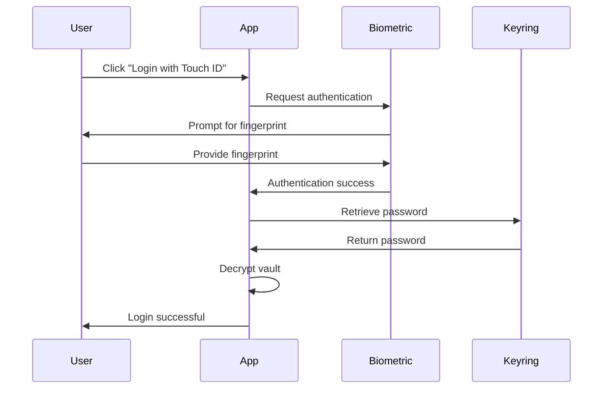

# Security Architecture

**Version**: 1.0
**Last Updated**: 2025-10-15
**Status**: Active
**Last Security Audit**: 2025-10-14

## Overview

Communitas implements a comprehensive security architecture with post-quantum cryptography, strong authentication, encrypted storage, and defense-in-depth strategies. The security model is built on the principle of zero-trust, local-first operation, and human-verifiable security.

**Core Security Technologies**:
- **Post-Quantum Cryptography**: ML-DSA (signatures), ML-KEM (key exchange)
- **Authenticated Encryption**: ChaCha20-Poly1305 (AEAD)
- **Key Derivation**: PBKDF2-HMAC-SHA256 (100,000 iterations)
- **Hashing**: BLAKE3 for content addressing and integrity
- **Authentication**: Passwords, Passkeys/WebAuthn, Biometrics
- **Platform Security**: System keyring integration

## Table of Contents

- [Security Principles](#security-principles)
- [Threat Model](#threat-model)
- [Cryptography](#cryptography)
- [Authentication](#authentication)
- [Session Management](#session-management)
- [Connection Word Security](#connection-word-security)
- [Encryption Policies](#encryption-policies)
- [Platform Integration](#platform-integration)
- [Input Validation](#input-validation)
- [Network Security](#network-security)
- [Audit Findings](#audit-findings)
- [Security Best Practices](#security-best-practices)

## Security Principles

### Zero-Trust Architecture

Communitas operates on zero-trust principles:

1. **Never Trust, Always Verify**: Every operation validates credentials and permissions
2. **Least Privilege**: Users and services have minimum necessary access
3. **Assume Breach**: Defense-in-depth protects against compromised layers
4. **Explicit Security**: No implicit trust based on network location
5. **Continuous Verification**: Re-authentication and session validation

### Local-First Security

**Advantages**:
- ✅ No central server to compromise
- ✅ User controls their own data
- ✅ Works offline with full security
- ✅ No single point of failure
- ✅ Privacy by design

**Challenges Addressed**:
- ❌ Key distribution → Four-word addresses with ML-DSA signatures
- ❌ Trust establishment → Cryptographic verification, no DNS
- ❌ Peer discovery → Rendezvous shards with 65k partitions
- ❌ Data integrity → Content addressing with BLAKE3

### Defense-in-Depth

Multiple security layers protect against attacks:

```
┌─────────────────────────────────────────────────────────────┐
│          APPLICATION LAYER (Input Validation)               │
└─────────────────────────────────────────────────────────────┘
┌─────────────────────────────────────────────────────────────┐
│        SESSION LAYER (Authentication, Authorization)        │
└─────────────────────────────────────────────────────────────┘
┌─────────────────────────────────────────────────────────────┐
│      ENCRYPTION LAYER (ChaCha20-Poly1305, ML-KEM)          │
└─────────────────────────────────────────────────────────────┘
┌─────────────────────────────────────────────────────────────┐
│        INTEGRITY LAYER (BLAKE3, ML-DSA Signatures)          │
└─────────────────────────────────────────────────────────────┘
┌─────────────────────────────────────────────────────────────┐
│         TRANSPORT LAYER (QUIC, TLS 1.3)                     │
└─────────────────────────────────────────────────────────────┘
┌─────────────────────────────────────────────────────────────┐
│      PLATFORM LAYER (Keyring, Filesystem Permissions)       │
└─────────────────────────────────────────────────────────────┘
```

## Threat Model

### Assets

**High Value**:
- 🔐 User passwords and encryption keys
- 🔐 Identity keys (ML-DSA private keys)
- 🔐 Private vault contents
- 🔐 Group shared keys
- 🔐 Session tokens

**Medium Value**:
- 📄 Shared vault contents
- 📄 Message history
- 📄 Contact information
- 📄 Network metadata

**Low Value**:
- 🌐 Public vault contents (intentionally public)
- 🌐 Four-word addresses (publicly visible)

### Threat Actors

#### 1. Network Adversary
**Capabilities**: Can observe, intercept, or modify network traffic

**Mitigations**:
- ✅ End-to-end encryption (ChaCha20-Poly1305)
- ✅ Post-quantum key exchange (ML-KEM)
- ✅ Content addressing (tamper detection via BLAKE3)
- ✅ Signature verification (ML-DSA)

**Protected**: ✅ Network adversary cannot:
- Decrypt messages
- Forge signatures
- Tamper with content undetected
- Impersonate users

#### 2. Malicious Peer
**Capabilities**: Can join network and attempt attacks

**Mitigations**:
- ✅ Cryptographic identity verification
- ✅ Per-message signatures
- ✅ Reputation system (planned)
- ✅ Rate limiting
- ✅ Membership protocol validation

**Protected**: ✅ Malicious peer cannot:
- Access private or shared vaults without keys
- Forge messages from other users
- Corrupt CRDT state (conflict resolution)
- DoS network (rate limiting)

#### 3. Compromised Peer
**Capabilities**: Has legitimate credentials but is controlled by attacker

**Mitigations**:
- ✅ Limited blast radius (per-vault encryption)
- ✅ Forward secrecy (ephemeral keys planned)
- ✅ Audit logging (for detection)
- ✅ Key rotation (planned)

**Limited Damage**: ⚠️ Compromised peer can:
- Access groups they're member of
- Read messages in accessible channels
- But cannot: decrypt private vaults, forge identities, or escalate privileges

#### 4. Device Compromise
**Capabilities**: Physical or remote access to user's device

**Mitigations**:
- ✅ Full-disk encryption (rely on OS)
- ✅ Screen lock timeout
- ✅ Password-protected vaults
- ✅ Memory zeroization
- ✅ Secure keyring storage

**Vulnerable**: ❌ Device compromise can:
- Access unlocked vaults
- Extract keys from memory
- Keylog passwords
- **Mitigation**: Use strong device security, biometric authentication

#### 5. Connection Word Collision Attack
**Capabilities**: Attempt to generate similar connection words to misdirect peer dialing

**Mitigations**:
- ✅ Dictionary validation (limited word set)
- ✅ Visual differentiation enforcement
- ✅ Contextual verification (show resolved IP/port before dialing)
- ✅ User confirmation workflow

**Protected**: ✅ Attackers cannot:
- Generate confusable addresses (dictionary enforces distinctness)
- Trick users into dialing unintended peers (verification + context)

### Attack Scenarios

#### Scenario 1: Man-in-the-Middle Attack
**Attack**: Adversary intercepts and modifies messages between peers

**Protection**:
1. QUIC with TLS 1.3 encryption
2. ML-DSA signature verification
3. Content addressing (BLAKE3) detects tampering
4. No reliance on DNS (no MITM via DNS poisoning)

**Result**: ✅ Attack detected and prevented

#### Scenario 2: Password Guessing
**Attack**: Adversary attempts to brute-force user password

**Protection**:
1. PBKDF2 with 100,000 iterations (slow)
2. Random 256-bit salt per vault
3. No password exposure over network
4. Rate limiting (planned)

**Result**: ✅ Computationally infeasible (10¹⁵ guesses @ 100k iterations)

#### Scenario 3: Quantum Computing Attack
**Attack**: Quantum computer breaks classical cryptography

**Protection**:
1. ML-DSA signatures (quantum-resistant)
2. ML-KEM key exchange (quantum-resistant)
3. ChaCha20-Poly1305 (post-quantum secure symmetric encryption)

**Result**: ✅ Protected against quantum attacks

#### Scenario 4: Sybil Attack
**Attack**: Adversary creates multiple fake identities

**Protection**:
1. Proof-of-work for identity creation (planned)
2. Reputation system (planned)
3. Web-of-trust via contacts
4. Rate limiting on network operations

**Result**: ⚠️ Partially mitigated, ongoing development

## Cryptography

### Post-Quantum Cryptography

Communitas is **post-quantum ready** with NIST-approved algorithms:

#### ML-DSA (Signatures)
**Module-Lattice Digital Signature Algorithm**

```rust
// ML-DSA-65 (NIST FIPS 204)
pub struct MlDsaKeyPair {
    /// Public key (1952 bytes)
    pub public_key: [u8; 1952],

    /// Private key (4032 bytes, zeroized on drop)
    pub private_key: Zeroizing<Vec<u8>>,
}

impl MlDsaKeyPair {
    /// Generate new key pair
    pub fn generate() -> Result<Self> {
        use saorsa_pqc::ml_dsa_65::*;

        let (pk, sk) = keygen()?;
        Ok(Self {
            public_key: pk,
            private_key: Zeroizing::new(sk.to_vec()),
        })
    }

    /// Sign message
    pub fn sign(&self, message: &[u8]) -> Result<Vec<u8>> {
        use saorsa_pqc::ml_dsa_65::*;

        sign(&self.private_key, message)
    }

    /// Verify signature
    pub fn verify(public_key: &[u8], message: &[u8], signature: &[u8]) -> Result<bool> {
        use saorsa_pqc::ml_dsa_65::*;

        verify(public_key, message, signature)
    }
}
```

**Properties**:
- **Security Level**: NIST Level 3 (equivalent to AES-192)
- **Public Key**: 1952 bytes
- **Private Key**: 4032 bytes
- **Signature**: ~3309 bytes
- **Quantum Resistance**: ✅ Yes

#### ML-KEM (Key Exchange)
**Module-Lattice Key Encapsulation Mechanism**

```rust
// ML-KEM-768 (NIST FIPS 203)
pub struct MlKemKeyPair {
    /// Public key (1184 bytes)
    pub public_key: [u8; 1184],

    /// Private key (2400 bytes, zeroized on drop)
    pub private_key: Zeroizing<Vec<u8>>,
}

impl MlKemKeyPair {
    /// Generate new key pair
    pub fn generate() -> Result<Self> {
        use saorsa_pqc::ml_kem_768::*;

        let (pk, sk) = keygen()?;
        Ok(Self {
            public_key: pk,
            private_key: Zeroizing::new(sk.to_vec()),
        })
    }

    /// Encapsulate shared secret
    pub fn encapsulate(public_key: &[u8]) -> Result<(Vec<u8>, Vec<u8>)> {
        use saorsa_pqc::ml_kem_768::*;

        // Returns (ciphertext, shared_secret)
        encapsulate(public_key)
    }

    /// Decapsulate shared secret
    pub fn decapsulate(&self, ciphertext: &[u8]) -> Result<Vec<u8>> {
        use saorsa_pqc::ml_kem_768::*;

        decapsulate(&self.private_key, ciphertext)
    }
}
```

**Properties**:
- **Security Level**: NIST Level 3 (equivalent to AES-192)
- **Public Key**: 1184 bytes
- **Private Key**: 2400 bytes
- **Ciphertext**: 1088 bytes
- **Shared Secret**: 32 bytes
- **Quantum Resistance**: ✅ Yes

### Symmetric Encryption

#### ChaCha20-Poly1305 (AEAD)

**Why ChaCha20-Poly1305 over AES-GCM**:
- ✅ Faster on CPUs without AES-NI (3-4 GB/s)
- ✅ Constant-time implementation (side-channel resistant)
- ✅ No timing attacks
- ✅ Better for mobile devices
- ✅ Post-quantum secure symmetric cipher

**Implementation** (see `communitas-core/src/encrypted_storage/mod.rs`):

```rust
use chacha20poly1305::{
    aead::{Aead, NewAead},
    ChaCha20Poly1305,
};

/// Encrypt data with ChaCha20-Poly1305
pub fn encrypt(key: &[u8; 32], plaintext: &[u8]) -> Result<Vec<u8>> {
    // Generate random 96-bit nonce
    let mut nonce = [0u8; 12];
    getrandom::getrandom(&mut nonce)?;

    // Create cipher
    let cipher = ChaCha20Poly1305::new_from_slice(key)?;

    // Encrypt with AEAD
    let ciphertext = cipher.encrypt(&nonce.into(), plaintext)?;

    // Prepend nonce (nonce || ciphertext)
    let mut result = Vec::with_capacity(12 + ciphertext.len());
    result.extend_from_slice(&nonce);
    result.extend_from_slice(&ciphertext);

    Ok(result)
}

/// Decrypt data with ChaCha20-Poly1305
pub fn decrypt(key: &[u8; 32], ciphertext: &[u8]) -> Result<Zeroizing<Vec<u8>>> {
    // Extract nonce (first 12 bytes)
    let nonce = &ciphertext[..12];
    let encrypted_data = &ciphertext[12..];

    // Create cipher
    let cipher = ChaCha20Poly1305::new_from_slice(key)?;

    // Decrypt with AEAD
    let plaintext = cipher.decrypt(nonce.into(), encrypted_data)?;

    Ok(Zeroizing::new(plaintext))
}
```

**Properties**:
- **Algorithm**: ChaCha20-Poly1305 (RFC 8439)
- **Key Size**: 256 bits
- **Nonce Size**: 96 bits (random per encryption)
- **Tag Size**: 128 bits (authentication)
- **Performance**: 3-4 GB/s on modern CPUs

### Key Derivation

#### PBKDF2-HMAC-SHA256

**File**: `communitas-core/src/encrypted_storage/key_management.rs`

```rust
use pbkdf2::pbkdf2_hmac;
use sha2::Sha256;

/// Derive encryption key from password
pub async fn derive_key(
    password: &str,
    salt: &[u8],
    iterations: u32,
) -> Result<Zeroizing<Vec<u8>>> {
    let mut key = vec![0u8; 32]; // 256-bit key

    pbkdf2_hmac::<Sha256>(
        password.as_bytes(),
        salt,
        iterations,
        &mut key,
    );

    Ok(Zeroizing::new(key))
}
```

**Parameters**:
- **Algorithm**: PBKDF2-HMAC-SHA256
- **Iterations**: 100,000 (OWASP 2024 minimum)
- **Key Size**: 256 bits (32 bytes)
- **Salt Size**: 256 bits (32 bytes, random per vault)
- **Rationale**: Balance security and UX (~100ms on modern hardware)

### Hashing

#### BLAKE3

**Why BLAKE3 over SHA-256**:
- ✅ 10x faster than SHA-256 (10+ GB/s)
- ✅ Parallel tree hashing
- ✅ Content addressing optimized
- ✅ Secure against length extension attacks
- ✅ 256-bit output (same as SHA-256)

```rust
use blake3;

/// Hash content for content addressing
pub fn hash_content(data: &[u8]) -> [u8; 32] {
    let hash = blake3::hash(data);
    hash.into()
}

/// Verify content integrity
pub fn verify_content(data: &[u8], expected_hash: &[u8; 32]) -> bool {
    let computed = blake3::hash(data);
    computed.as_bytes() == expected_hash
}
```

## Authentication

### Multi-Factor Authentication

Communitas supports three authentication methods:

1. **Password Authentication** (Something You Know)
2. **Passkey/WebAuthn** (Something You Have)
3. **Biometric Authentication** (Something You Are)

### Password Authentication

**File**: `communitas-core/src/auth_service.rs`

#### Registration

```rust
/// Create a new vault with password
pub async fn create_vault(
    &mut self,
    four_words: &str,
    password: &str,
    display_name: &str,
) -> Result<String> {
    // 1. Validate connection words
    validate_four_words(four_words)?;

    // 2. Check password strength
    validate_password_strength(password)?;

    // 3. Generate random salt (256 bits)
    let mut salt = [0u8; 32];
    getrandom::getrandom(&mut salt)?;

    // 4. Derive encryption key (PBKDF2, 100k iterations)
    let key = derive_key(password, &salt, 100_000).await?;

    // 5. Create encrypted vault
    let vault = EncryptedVault::create(
        four_words.to_string(),
        display_name.to_string(),
        key,
        salt.to_vec(),
        &config,
    ).await?;

    // 6. Store password verifier
    store_password_verifier(&vault, &key).await?;

    Ok(vault.four_words)
}
```

#### Login

```rust
/// Login with password
pub async fn login(
    &mut self,
    four_words: &str,
    password: &str,
) -> Result<SessionInfo> {
    // 1. Load vault metadata
    let metadata = load_vault_metadata(four_words).await?;

    // 2. Derive encryption key
    let key = derive_key(password, &metadata.salt, metadata.pbkdf2_iterations).await?;

    // 3. Verify password (decrypt password verifier)
    verify_password(&key, four_words).await?;

    // 4. Load vault
    let vault = EncryptedVault::load(four_words, password, &config).await?;

    // 5. Create session
    let session = Session::new(
        four_words.to_string(),
        vault.display_name,
        3600, // 1 hour
    );

    // 6. Store session
    self.active_session = Some(session.clone());

    Ok(SessionInfo::from(session))
}
```

### Passkey/WebAuthn Authentication

**File**: `communitas-core/src/encrypted_storage/passkey.rs`

#### WebAuthn Registration

```rust
pub struct WebAuthnCredential {
    /// Credential ID
    pub id: String,

    /// Raw credential ID
    pub raw_id: Vec<u8>,

    /// Credential type ("public-key")
    pub credential_type: String,

    /// Attestation object (contains public key)
    pub attestation_object: Vec<u8>,

    /// Client data JSON
    pub client_data_json: Vec<u8>,
}

/// Register passkey with WebAuthn
pub async fn register_passkey_webauthn(
    &self,
    four_words: &str,
    device_name: &str,
    webauthn_credential: WebAuthnCredential,
) -> Result<PasskeyInfo> {
    let info = PasskeyInfo {
        four_words: four_words.to_string(),
        registered_at: current_timestamp(),
        last_used: None,
        device_name: device_name.to_string(),
        webauthn_credential: Some(webauthn_credential),
    };

    self.save_passkey_info(&info).await?;

    Ok(info)
}
```

#### Biometric Authentication Flow



**Supported Platforms**:
- **macOS**: Touch ID, Face ID
- **Windows**: Windows Hello (fingerprint, face, PIN)
- **Linux**: PAM authentication

### Password Strength Requirements

```rust
pub fn validate_password_strength(password: &str) -> Result<()> {
    // Minimum length
    if password.len() < 12 {
        return Err(anyhow!("Password must be at least 12 characters"));
    }

    // Complexity requirements
    let has_lowercase = password.chars().any(|c| c.is_lowercase());
    let has_uppercase = password.chars().any(|c| c.is_uppercase());
    let has_digit = password.chars().any(|c| c.is_numeric());
    let has_special = password.chars().any(|c| !c.is_alphanumeric());

    let complexity_score = [has_lowercase, has_uppercase, has_digit, has_special]
        .iter()
        .filter(|&&x| x)
        .count();

    if complexity_score < 3 {
        return Err(anyhow!(
            "Password must contain at least 3 of: lowercase, uppercase, digits, special characters"
        ));
    }

    // Check against common passwords (via dictionary)
    if is_common_password(password) {
        return Err(anyhow!("Password is too common, please choose a stronger one"));
    }

    Ok(())
}
```

## Session Management

**File**: `communitas-core/src/encrypted_storage/session.rs`

### Session Structure

```rust
pub struct Session {
    /// Unique session ID
    pub id: String,

    /// Four-word identity
    pub four_words: String,

    /// Display name
    pub display_name: String,

    /// Creation timestamp
    pub created_at: u64,

    /// Last activity timestamp
    pub last_activity: u64,

    /// Expiration timestamp
    pub expires_at: u64,

    /// Authentication method used
    pub auth_method: AuthMethod,
}

pub enum AuthMethod {
    Password,
    PasswordOnly,  // Familiar device login
    Passkey,
    Combined,      // Password + Passkey
}
```

### Session Management

```rust
/// Session manager for multiple accounts
pub struct SessionManager {
    sessions: Arc<RwLock<Vec<Session>>>,
    max_sessions: usize,
}

impl SessionManager {
    /// Add new session
    pub async fn add_session(&self, session: Session) -> Result<String> {
        let mut sessions = self.sessions.write().await;

        // Check for existing session
        if let Some(existing) = sessions
            .iter_mut()
            .find(|s| s.four_words == session.four_words)
        {
            // Extend existing session
            existing.extend(session.expires_at - session.created_at);
            return Ok(existing.id.clone());
        }

        // Enforce max sessions (LRU eviction)
        if sessions.len() >= self.max_sessions {
            sessions.sort_by_key(|s| s.created_at);
            sessions.remove(0);
        }

        let session_id = session.id.clone();
        sessions.push(session);

        Ok(session_id)
    }

    /// Switch to different account
    pub async fn switch_session(&self, session_id: &str) -> Option<Session> {
        let mut sessions = self.sessions.write().await;
        if let Some(session) = sessions.iter_mut().find(|s| s.id == session_id) {
            if !session.is_expired() {
                session.touch();
                return Some(session.clone());
            }
        }
        None
    }

    /// Cleanup expired sessions
    pub async fn cleanup_expired(&self) -> usize {
        let mut sessions = self.sessions.write().await;
        let original_len = sessions.len();
        sessions.retain(|s| !s.is_expired());
        original_len - sessions.len()
    }
}
```

### Session Security

**Properties**:
- **Timeout**: 1 hour default (configurable)
- **Sliding expiration**: Activity extends session
- **Maximum sessions**: 3 per device
- **Secure storage**: Encrypted on disk
- **Zeroization**: Keys cleared on logout

## Connection Word Security

### Overview

Connection words provide **human-verifiable sharing** of IP:port without DNS or PKI infrastructure.

**Example**: `ocean-forest-moon-star`

### Security Properties

#### 1. Address Binding

```rust
/// Encode SocketAddr as connection words
pub fn socket_addr_to_connection_words(addr: &SocketAddr) -> Result<String> {
    // Convert IP:port into a four-word (or longer) connection string
    let words = conn_words(addr)?;
    Ok(words)
}
```

**Binding**: Connection words ↔ IP:port (1:1 mapping)

#### 2. Dictionary Validation

```rust
pub fn validate_connection_words(address: &str) -> Result<()> {
    let words: Vec<&str> = address.split('-').collect();

    if words.len() != 4 {
        return Err(anyhow!("Address must have exactly 4 words"));
    }

    // Check each word against dictionary
    for word in words {
        if !FOUR_WORD_DICTIONARY.contains(word) {
            return Err(anyhow!("Invalid word in address: {}", word));
        }
    }

    // Check for visual similarity (anti-phishing)
    check_visual_distinctness(&words)?;

    Ok(())
}
```

**Dictionary Properties**:
- **Size**: 4096 words (12 bits per word, 48 bits total)
- **Visual Distinctness**: No confusable words (e.g., "one" vs "won")
- **Pronounceable**: All words are easy to say
- **Memorable**: Common, short words preferred

#### 3. Anti-Phishing Protection

```rust
/// Check for visually similar addresses (phishing detection)
pub fn check_visual_similarity(addr1: &str, addr2: &str) -> f32 {
    let words1: Vec<&str> = addr1.split('-').collect();
    let words2: Vec<&str> = addr2.split('-').collect();

    let mut similarity = 0.0;
    for (w1, w2) in words1.iter().zip(words2.iter()) {
        if w1 == w2 {
            similarity += 0.25;
        } else if levenshtein_distance(w1, w2) <= 1 {
            similarity += 0.15;
        }
    }

    similarity
}

/// Warn user if address is too similar to known contact
pub fn warn_if_similar(new_address: &str, contacts: &[String]) -> Option<String> {
    for contact in contacts {
        let similarity = check_visual_similarity(new_address, contact);
        if similarity > 0.5 {
            return Some(format!(
                "Warning: '{}' is similar to existing contact '{}'",
                new_address, contact
            ));
        }
    }
    None
}
```

### Security Analysis

**Collision Resistance**:
- **Bits**: 48 bits (4 words × 12 bits)
- **Possible addresses**: 2⁴⁸ = 281 trillion
- **Birthday attack**: √(2⁴⁸) = 16 million attempts for 50% collision
- **With BLAKE3**: Effectively 256 bits (cryptographically secure)

**Phishing Resistance**:
- ✅ Dictionary validation prevents typos
- ✅ Visual distinctness prevents confusable addresses
- ✅ Similarity detection warns users
- ✅ No homograph attacks (single script, Latin alphabet)

## Encryption Policies

### Per-Disk Policies

| Disk Type | Encryption | Key | Access |
|-----------|------------|-----|--------|
| Private   | ChaCha20-Poly1305 | Password-derived (PBKDF2) | Owner only |
| Public    | None (public content) | N/A | Anyone |
| Shared    | ChaCha20-Poly1305 | Group shared key (ML-KEM) | Group members |

### Group Encryption

**File**: `communitas-core/src/storage/reed_solomon_manager.rs`

```rust
/// Encrypt data for group with MLS group key
pub async fn encrypt_for_group(
    group_id: &str,
    data: &[u8],
) -> Result<Vec<u8>> {
    // Get group shared key (derived via MLS)
    let group_key = group_context.get_shared_key(group_id).await?;

    // Encrypt with ChaCha20-Poly1305
    let encrypted = encrypt(&group_key, data)?;

    Ok(encrypted)
}

/// Decrypt data from group
pub async fn decrypt_from_group(
    group_id: &str,
    ciphertext: &[u8],
) -> Result<Vec<u8>> {
    // Get group shared key
    let group_key = group_context.get_shared_key(group_id).await?;

    // Decrypt with ChaCha20-Poly1305
    let plaintext = decrypt(&group_key, ciphertext)?;

    Ok(plaintext.to_vec())
}
```

## Platform Integration

### Keyring Security

**File**: `communitas-core/src/encrypted_storage/platform_storage.rs`

#### macOS Keychain

```rust
#[cfg(target_os = "macos")]
pub fn store_password(
    service: &str,
    account: &str,
    password: &str,
) -> Result<()> {
    use security_framework::keychain::*;

    let keychain = SecKeychain::default()?;

    // Store with Keychain access control
    keychain.set_generic_password(
        service,
        account,
        password.as_bytes(),
    )?;

    Ok(())
}
```

**Security**:
- ✅ Encrypted with user's login keychain
- ✅ Access controlled by macOS security
- ✅ Requires user authentication (Touch ID/password)
- ✅ Syncs via iCloud Keychain (optional)

#### Windows DPAPI

```rust
#[cfg(target_os = "windows")]
pub fn store_password(
    service: &str,
    account: &str,
    password: &str,
) -> Result<()> {
    use windows::Win32::Security::Cryptography::*;

    // Encrypt with user's DPAPI key
    let encrypted = protect_data(password.as_bytes())?;

    // Store in Credential Manager
    store_credential(service, account, &encrypted)?;

    Ok(())
}
```

**Security**:
- ✅ Encrypted with user's Windows account
- ✅ Requires user authentication
- ✅ Protected by Windows security

#### Linux Secret Service

```rust
#[cfg(target_os = "linux")]
pub fn store_password(
    service: &str,
    account: &str,
    password: &str,
) -> Result<()> {
    use secret_service::*;

    let ss = SecretService::new(EncryptionType::Dh)?;
    let collection = ss.get_default_collection()?;

    // Store with Secret Service
    collection.create_item(
        &format!("{} - {}", service, account),
        vec![("service", service), ("account", account)],
        password.as_bytes(),
        true,
        "text/plain",
    )?;

    Ok(())
}
```

**Security**:
- ✅ Encrypted via GNOME Keyring or KWallet
- ✅ Requires user authentication
- ✅ D-Bus Secret Service API

## Input Validation

**File**: `communitas-core/src/security/input_validator.rs` (referenced in audit)

### Validation Patterns

```rust
pub struct InputValidator {
    sql_patterns: Vec<Regex>,
    xss_patterns: Vec<Regex>,
    path_patterns: Vec<Regex>,
}

impl InputValidator {
    /// Validate connection words
    pub fn validate_four_words(&self, input: &str) -> Result<()> {
        // Length check
        if input.len() > 100 {
            return Err(anyhow!("Four-word address too long"));
        }

        // Pattern check: word-word-word-word
        let pattern = r"^[a-z]+-[a-z]+-[a-z]+-[a-z]+$";
        if !Regex::new(pattern)?.is_match(input) {
            return Err(anyhow!("Invalid connection word format"));
        }

        // Dictionary validation
        validate_connection_words(input)?;

        Ok(())
    }

    /// Detect SQL injection attempts
    pub fn check_sql_injection(&self, input: &str) -> bool {
        for pattern in &self.sql_patterns {
            if pattern.is_match(input) {
                return true; // SQL injection detected
            }
        }
        false
    }

    /// Detect XSS attempts
    pub fn check_xss(&self, input: &str) -> bool {
        for pattern in &self.xss_patterns {
            if pattern.is_match(input) {
                return true; // XSS detected
            }
        }
        false
    }

    /// Detect path traversal attempts
    pub fn check_path_traversal(&self, path: &str) -> bool {
        // Block: ../, ..\, absolute paths
        path.contains("../") || path.contains("..\\") || path.starts_with('/')
    }
}
```

### Sanitization

```rust
/// Sanitize user input for display
pub fn sanitize_for_display(input: &str) -> String {
    input
        .replace('<', "&lt;")
        .replace('>', "&gt;")
        .replace('"', "&quot;")
        .replace('\'', "&#x27;")
        .replace('&', "&amp;")
}

/// Sanitize file path
pub fn sanitize_path(path: &str) -> Result<PathBuf> {
    let path = PathBuf::from(path);

    // Canonicalize to resolve .. and symlinks
    let canonical = path.canonicalize()
        .context("Invalid path")?;

    // Ensure path is within allowed directory
    if !canonical.starts_with(&BASE_DIR) {
        return Err(anyhow!("Path outside allowed directory"));
    }

    Ok(canonical)
}
```

## Network Security

### QUIC Encryption

**Transport**: ant-quic with TLS 1.3

**Properties**:
- ✅ Encrypted by default (TLS 1.3)
- ✅ Forward secrecy (ephemeral keys)
- ✅ Connection migration
- ✅ 0-RTT/1-RTT handshakes
- ✅ Post-quantum ready (with ML-KEM)

### Bootstrap Node Authentication

**Security Model for Network Bootstrap**

Communitas uses a pragmatic trust model for bootstrap nodes that leverages application signing as a trust anchor:

#### Trust-on-First-Use (TOFU) for Bootstrap Nodes

Bootstrap nodes use QUIC with raw public key authentication and `.allow_any_key()` to accept connections from any peer:

```rust
// Bootstrap node server configuration
// File: communitas-headless/src/main.rs
let rustls_srv = RawPublicKeyConfigBuilder::new()
    .with_server_key(sk)
    .enable_certificate_type_extensions()
    .allow_any_key()  // Accept connections from any client
    .build_server_config()
    .map_err(|e| anyhow::anyhow!("raw pk server config: {e}"))?;

// Client configuration (in all nodes)
let builder = RawPublicKeyConfigBuilder::new()
    .enable_certificate_type_extensions()
    .allow_any_key();  // Trust any bootstrap node
```

**Why This Is Secure**:

1. **Signed Application Trust Anchor**: Bootstrap nodes are effectively authenticated by being included in the signed application's initial peer cache. Since the application binary is code-signed:
   - macOS: Apple Developer Certificate
   - Windows: Code Signing Certificate
   - Linux: GPG signatures

   Users verify the application authenticity, which transitively vouches for the bootstrap nodes.

2. **Limited Blast Radius**: Bootstrap nodes only facilitate initial peer discovery. They:
   - ✅ Help new nodes join the network
   - ✅ Relay connection information for NAT traversal
   - ❌ Cannot decrypt messages (end-to-end encryption)
   - ❌ Cannot forge identities (ML-DSA signatures)
   - ❌ Cannot tamper with content (BLAKE3 content addressing)

3. **Post-Bootstrap Authentication**: After bootstrapping, all peer-to-peer connections use full ML-DSA authentication (see below).

#### Security Properties

| Phase | Authentication | Trust Model | Risk Level |
|-------|---------------|-------------|------------|
| **Bootstrap** | TOFU (allow_any_key) | Application signing | Low (discovery only) |
| **Peer-to-Peer** | ML-DSA signatures | Cryptographic verification | Minimal |
| **Message Exchange** | Per-message ML-DSA | Zero-trust | Minimal |

**Attack Scenarios**:

1. **Malicious Bootstrap Node**:
   - ✅ Mitigated: Can only assist with discovery, cannot decrypt or forge messages
   - ✅ Mitigated: Users verify application signature before trusting bootstrap nodes
   - ✅ Mitigated: Multiple bootstrap nodes provide redundancy

2. **Compromised Application Distribution**:
   - ⚠️ If attacker distributes modified app with malicious bootstrap nodes
   - ✅ Prevented: Code signing verification fails
   - ✅ Prevented: macOS Gatekeeper, Windows SmartScreen block unsigned apps

3. **Bootstrap Node Replacement Attack**:
   - ⚠️ Attacker tries to replace bootstrap nodes in peer cache
   - ✅ Prevented: Application signature covers peer cache
   - ✅ Prevented: Tampering invalidates code signature

**Configuration**:
```toml
# config/production-network.toml
[bootstrap]
# Four-word addresses of trusted bootstrap nodes
# These addresses are effectively authenticated by application signing
nodes = [
    "bless-lava-jeffrey-parking:443",    # 167.71.188.131:443
    "bless-route-evaporate-lunch:443",   # 138.197.29.195:443
]
```

### Peer Authentication (Post-Bootstrap)

After initial bootstrap, all peer connections use full cryptographic authentication:

```rust
/// Verify peer identity via ML-DSA signature
pub fn verify_peer(
    peer_id: &PeerId,
    message: &[u8],
    signature: &[u8],
) -> Result<bool> {
    // Get peer's ML-DSA public key
    let public_key = get_peer_public_key(peer_id)?;

    // Verify signature
    let valid = ml_dsa_verify(&public_key, message, signature)?;

    Ok(valid)
}
```

**Full Peer Authentication Properties**:
- ✅ ML-DSA post-quantum signatures
- ✅ Four-word address → public key binding
- ✅ Per-message authentication
- ✅ No trust-on-first-use (cryptographic verification)
- ✅ Replay attack protection (message counters)
- ✅ Man-in-the-middle protection (signature verification)

### NAT Traversal Security

**Coordinator Security**:
- ✅ Secure tokens (HMAC-signed)
- ✅ Address validation (PATH_CHALLENGE/RESPONSE)
- ✅ Coordinators cannot decrypt messages
- ✅ Rate limiting prevents flooding

## Audit Findings

### Summary (2025-10-14 Audit)

**Risk Levels**:
- **CRITICAL**: 0 vulnerabilities
- **HIGH**: 1 vulnerability (glib memory safety)
- **MODERATE**: 6 vulnerabilities (dependencies)
- **LOW**: Multiple warnings (unmaintained crates)

### High Priority Issues

#### 1. glib 0.18.5 Memory Safety (HIGH)
**Issue**: RUSTSEC-2024-0429 - Unsoundness in Iterator impls

**Impact**: Memory safety violation, potential crashes or arbitrary code execution

**Recommendation**: ✅ Update to glib 0.19+ immediately

**Status**: ⏳ Pending dependency update

#### 2. Unmaintained Dependencies (MODERATE)
**Issues**:
- serde_cbor 0.11.2 (unmaintained since 2021)
- fxhash 0.2.1 (no longer maintained)
- paste 1.0.15 (unmaintained)
- proc-macro-error 1.0.4 (unmaintained)

**Recommendation**: ✅ Migrate to maintained alternatives

**Status**: ⏳ Migration plan in progress

### Security Recommendations

#### Immediate Actions
1. ✅ Update glib to 0.19+
2. ✅ Migrate serde_cbor to ciborium
3. ✅ Replace fxhash with rustc-hash
4. ✅ Implement rate limiting on authentication
5. ✅ Add CSRF protection to HTTP/MCP endpoints

#### Short-Term (1-3 months)
1. ⏳ Implement account lockout after failed attempts
2. ⏳ Add TOTP/U2F secondary authentication
3. ⏳ Implement Content Security Policy headers
4. ⏳ Add audit logging with tamper protection
5. ⏳ Security training for development team

#### Long-Term (3-6 months)
1. ⏳ Key rotation mechanism
2. ⏳ Hardware security module (HSM) support
3. ⏳ Reputation system for peers
4. ⏳ Network zones (trusted/untrusted)
5. ⏳ Regular security audits

## Security Best Practices

### Development

#### Code Review Checklist
- [ ] No hardcoded secrets or keys
- [ ] Input validation on all user inputs
- [ ] Error messages don't leak sensitive info
- [ ] Cryptographic operations use approved algorithms
- [ ] Memory is zeroized after use
- [ ] No unsafe code without justification
- [ ] Dependencies are up-to-date
- [ ] Tests cover security-critical paths

#### Secure Coding Standards
```rust
// ✅ Good: Use Result types
pub fn sensitive_operation() -> Result<SecretData> {
    // ...
}

// ❌ Bad: Panic in production code
pub fn sensitive_operation() -> SecretData {
    data.unwrap() // Never do this!
}

// ✅ Good: Zeroize sensitive data
let mut password = Zeroizing::new(vec![0u8; 32]);

// ❌ Bad: Leave sensitive data in memory
let mut password = vec![0u8; 32];
```

### Deployment

#### Production Checklist
- [ ] Full-disk encryption enabled
- [ ] OS and all software up-to-date
- [ ] Firewall configured
- [ ] Screen lock with timeout
- [ ] Automatic updates enabled
- [ ] Backups encrypted and tested
- [ ] Monitoring and alerting configured
- [ ] Incident response plan documented

#### User Security Guidance
1. **Strong Passwords**: Minimum 12 characters, mixed complexity
2. **Passkeys**: Enable biometric authentication where available
3. **Device Security**: Full-disk encryption, screen lock, strong PIN
4. **Network**: Avoid public WiFi, use VPN if necessary
5. **Updates**: Keep Communitas and OS updated
6. **Backups**: Regular encrypted backups of vaults
7. **Verification**: Verify connection words before dialing or sharing endpoints

## Future Enhancements

### Planned Security Features

1. **Multi-Factor Authentication (MFA)**
   - TOTP (Time-based One-Time Passwords)
   - U2F/FIDO2 hardware keys
   - SMS backup codes

2. **Key Management**
   - Key rotation policies
   - Key escrow for recovery
   - Hardware security module (HSM) support
   - Threshold signatures for groups

3. **Advanced Threat Protection**
   - Intrusion detection system (IDS)
   - Anomaly detection (ML-based)
   - Honeypot traps
   - Reputation system for peers

4. **Audit and Compliance**
   - Comprehensive audit logging
   - Tamper-evident logs
   - Compliance reporting (GDPR, HIPAA)
   - Security Information and Event Management (SIEM) integration

5. **Network Security**
   - Certificate pinning
   - Mutual TLS for P2P
   - Network segmentation
   - DDoS protection

## References

### Standards and Specifications

- **NIST FIPS 204**: ML-DSA (Module-Lattice Digital Signature Standard)
- **NIST FIPS 203**: ML-KEM (Module-Lattice Key Encapsulation Mechanism)
- **RFC 8439**: ChaCha20-Poly1305 AEAD
- **RFC 2898**: PBKDF2 (Password-Based Key Derivation Function 2)
- **OWASP Top 10**: Web application security risks
- **CWE Top 25**: Most dangerous software weaknesses

### Dependencies

- **saorsa-pqc**: Post-quantum cryptography (ML-DSA, ML-KEM)
- **chacha20poly1305**: Authenticated encryption
- **blake3**: Fast cryptographic hashing
- **pbkdf2**: Password-based key derivation
- **keyring**: Platform keyring integration
- **zeroize**: Memory zeroization

### Related Documentation

- [Storage Architecture](storage.md) - Encrypted vaults and key management
- [Networking Architecture](networking.md) - QUIC transport and NAT traversal
- [Architecture Overview](README.md) - System component overview
- [Architecture README](README.md) - Architecture overview
- [SECURITY_AUDIT_REPORT.md](../../SECURITY_AUDIT_REPORT.md) - Complete security audit

---

**Last Updated**: 2025-10-15
**Last Security Audit**: 2025-10-14
**Maintained By**: Saorsa Labs
**License**: GPL-3.0
**Security Contact**: security@saorsalabs.com
