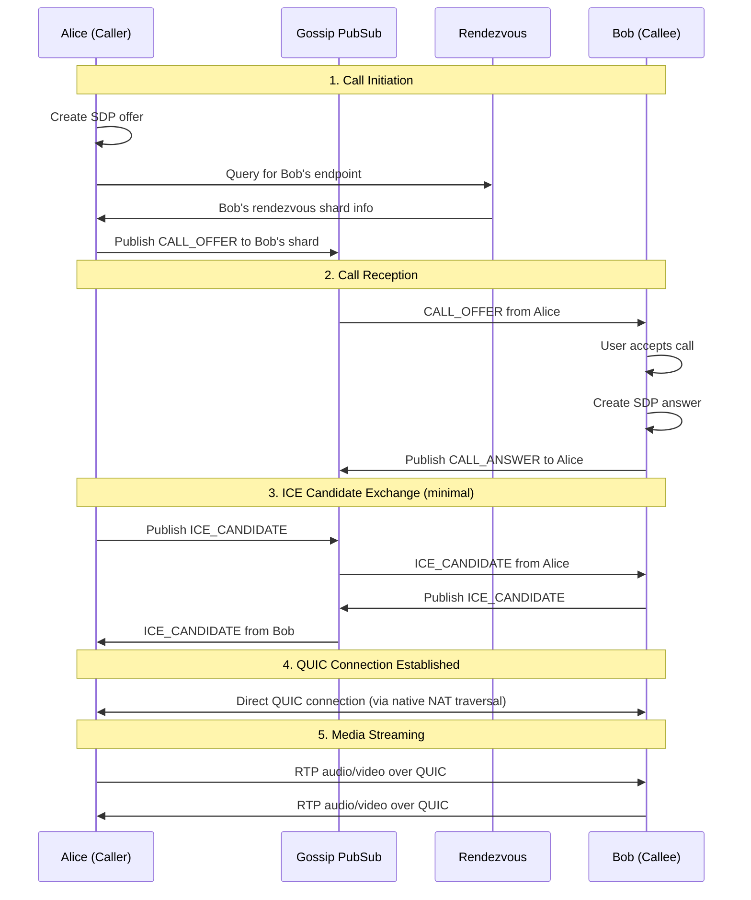

# WebRTC Multimedia Communication

**Version**: 1.0
**Last Updated**: 2025-10-16
**Status**: Active

## Overview

Communitas provides real-time multimedia communication (voice, video, screen sharing) using **saorsa-webrtc**, a WebRTC implementation built on top of ant-quic instead of traditional ICE/STUN/TURN protocols. This provides a fully decentralized, post-quantum secure, and highly performant multimedia communication system.

**Key Features**:
- **Voice Calling**: Crystal-clear audio with Opus codec
- **Video Calling**: HD video with VP8/VP9/H.264 codecs
- **Screen Sharing**: High-quality screen sharing for collaboration
- **Group Calls**: Multi-party conferencing with automatic mixing
- **Post-Quantum Security**: All media encrypted with PQC-ready protocols
- **Zero Infrastructure**: No STUN/TURN servers required
- **Decentralized**: Peer-to-peer with gossip-based signaling

## Table of Contents

- [Architecture Overview](#architecture-overview)
- [Signaling Layer](#signaling-layer)
- [Media Transport](#media-transport)
- [Call Management](#call-management)
- [Group Calls](#group-calls)
- [Screen Sharing](#screen-sharing)
- [Security](#security)
- [Performance](#performance)
- [API Reference](#api-reference)
- [Frontend Integration](#frontend-integration)

## Architecture Overview

### System Architecture

```
┌─────────────────────────────────────────────────────────────┐
│                   REACT FRONTEND                            │
│  - Call UI (accept/reject, controls)                        │
│  - Video/audio preview                                      │
│  - Screen share picker                                      │
│  - Group call UI                                            │
└─────────────────────────────────────────────────────────────┘
                           ↓ (Tauri IPC)
┌─────────────────────────────────────────────────────────────┐
│                   TAURI COMMANDS                            │
│  - initiate_call(), answer_call(), end_call()              │
│  - enable_video(), enable_screen_share()                    │
│  - get_media_devices(), set_audio_device()                  │
└─────────────────────────────────────────────────────────────┘
                           ↓
┌─────────────────────────────────────────────────────────────┐
│              COMMUNITAS WEBRTC SERVICE                      │
│  - WebRtcService<GossipIdentity, GossipSignaling>          │
│  - Call state management                                    │
│  - Media stream handling                                    │
│  - Event broadcasting                                       │
└─────────────────────────────────────────────────────────────┘
                           ↓
┌─────────────────────────────────────────────────────────────┐
│                 GOSSIP SIGNALING LAYER                      │
│  - SDP offer/answer exchange via PubSub                    │
│  - ICE candidate exchange (minimal, for compatibility)      │
│  - Peer discovery via Rendezvous                            │
└─────────────────────────────────────────────────────────────┘
                           ↓
┌─────────────────────────────────────────────────────────────┐
│                  SAORSA-WEBRTC LIBRARY                      │
│  - WebRTC protocol implementation                           │
│  - Media device management                                  │
│  - RTP/RTCP handling                                        │
│  - Codec negotiation                                        │
└─────────────────────────────────────────────────────────────┘
                           ↓
┌─────────────────────────────────────────────────────────────┐
│                   QUIC BRIDGE                               │
│  - RTP → QUIC stream translation                           │
│  - QoS management (audio: 50ms, video: 150ms, screen: 200ms)│
│  - Media prioritization                                     │
└─────────────────────────────────────────────────────────────┘
                           ↓
┌─────────────────────────────────────────────────────────────┐
│                   ANT-QUIC TRANSPORT                        │
│  - Encrypted QUIC connections                               │
│  - Native NAT traversal (no STUN/TURN)                      │
│  - Connection migration                                     │
│  - Post-quantum cryptography                                │
└─────────────────────────────────────────────────────────────┘
```

### Core Components

#### 1. WebRTC Service
**File**: `communitas-core/src/webrtc/service.rs`

Central orchestrator for all multimedia operations:
```rust
pub struct CommunitasWebRtcService {
    /// WebRTC service instance
    service: Arc<WebRtcService<GossipIdentity, GossipSignalingTransport>>,

    /// Active calls by call ID
    active_calls: Arc<RwLock<HashMap<CallId, CallInfo>>>,

    /// Event subscribers
    event_subscribers: Arc<RwLock<Vec<EventSender>>>,
}
```

#### 2. Gossip Signaling Transport
**File**: `communitas-core/src/webrtc/gossip_signaling.rs`

Implements signaling over gossip overlay:
```rust
pub struct GossipSignalingTransport {
    /// Gossip context for P2P communication
    gossip_context: Arc<GossipContext>,

    /// Rendezvous client for peer discovery
    rendezvous: Arc<RendezvousClient>,

    /// PubSub layer for signaling messages
    pubsub: Arc<RwLock<Box<dyn PubSub>>>,

    /// Incoming signaling message queue
    message_queue: Arc<RwLock<VecDeque<(GossipIdentity, SignalingMessage)>>>,
}
```

#### 3. Call Manager
**File**: `communitas-core/src/webrtc/call_manager.rs`

Manages call lifecycle and state:
```rust
pub struct CallManager {
    /// Active calls
    calls: Arc<RwLock<HashMap<CallId, ActiveCall>>>,

    /// WebRTC service
    webrtc_service: Arc<CommunitasWebRtcService>,
}

pub struct ActiveCall {
    pub call_id: CallId,
    pub state: CallState,
    pub participants: Vec<GossipIdentity>,
    pub media_constraints: MediaConstraints,
    pub started_at: DateTime<Utc>,
}
```

## Signaling Layer

### Gossip-Based Signaling

Communitas uses the gossip overlay network for WebRTC signaling, eliminating the need for centralized signaling servers.

**Signaling Flow**:



### Signaling Message Types

```rust
pub enum SignalingMessage {
    /// Call offer with SDP
    CallOffer {
        call_id: CallId,
        sdp: String,
        media_types: Vec<MediaType>,
    },

    /// Call answer with SDP
    CallAnswer {
        call_id: CallId,
        sdp: String,
        accepted: bool,
    },

    /// ICE candidate (minimal usage)
    IceCandidate {
        call_id: CallId,
        candidate: String,
        sdp_mid: Option<String>,
        sdp_m_line_index: Option<u16>,
    },

    /// Call ended
    CallEnded {
        call_id: CallId,
        reason: EndReason,
    },

    /// Media control (mute/unmute)
    MediaControl {
        call_id: CallId,
        action: MediaAction,
    },
}
```

### Peer Discovery via Rendezvous

When initiating a call to a four-word address:

1. **Hash four-word address** → shard_id (one of 65,536 shards)
2. **Subscribe to rendezvous shard** for target peer
3. **Collect provider summaries** (peers providing media for target)
4. **Score providers** by:
   - Latency
   - NAT classification
   - Media capabilities
5. **Connect to best provider** via QUIC

## Media Transport

### QUIC Bridge Architecture

Traditional WebRTC uses UDP for media transport. saorsa-webrtc bridges RTP packets to QUIC streams for enhanced reliability and security.

**File**: `saorsa-webrtc/src/quic_bridge.rs`

```rust
pub struct QuicBridge {
    /// QUIC connection
    connection: Arc<Connection>,

    /// Active media streams
    streams: Arc<RwLock<HashMap<MediaType, QuicMediaStream>>>,

    /// QoS parameters per media type
    qos_config: QoSConfig,
}

pub struct QoSConfig {
    /// Audio latency target: 50ms
    pub audio_latency_ms: u64,

    /// Video latency target: 150ms
    pub video_latency_ms: u64,

    /// Screen share latency target: 200ms
    pub screen_share_latency_ms: u64,

    /// Maximum retransmission attempts
    pub max_retries: usize,
}
```

### Media Stream Mapping

| Media Type | QUIC Stream Type | Priority | Latency Target | Codec |
|------------|------------------|----------|----------------|-------|
| **Audio** | Bidirectional | High (10) | 50ms | Opus (48kHz, stereo) |
| **Video** | Bidirectional | Medium (5) | 150ms | VP9/H.264 |
| **Screen Share** | Unidirectional | Low (3) | 200ms | VP9 (lossless) |
| **Data Channel** | Bidirectional | Medium (5) | Best effort | N/A |

### RTP to QUIC Translation

**Process**:

1. **RTP Packet Reception**:
   - WebRTC generates RTP packets from media devices
   - Packets buffered by media type

2. **QUIC Stream Transmission**:
   - Each media type gets dedicated QUIC stream
   - RTP packets wrapped in QUIC frames
   - QoS priority applied based on media type

3. **QUIC Stream Reception**:
   - QUIC frames unwrapped to RTP packets
   - Packets delivered to WebRTC for playback

4. **Quality Adaptation**:
   - Monitor QUIC stream congestion
   - Adjust codec bitrate dynamically
   - Maintain target latency

## Call Management

### Call State Machine

```
                ┌──────┐
                │ Idle │
                └──┬───┘
                   │
      initiate_call() or receive_offer()
                   │
                   ▼
              ┌─────────┐
              │ Calling │ (ringing)
              └────┬────┘
                   │
          accept_call() / send_answer()
                   │
                   ▼
            ┌────────────┐
            │ Connecting │ (negotiating)
            └──────┬─────┘
                   │
         ICE connected + media flowing
                   │
                   ▼
             ┌───────────┐
             │ Connected │ (active call)
             └─────┬─────┘
                   │
          end_call() or peer hangup
                   │
                   ▼
              ┌────────┐
              │ Ending │
              └────┬───┘
                   │
           cleanup complete
                   │
                   ▼
                ┌──────┐
                │ Idle │
                └──────┘
```

### One-to-One Calls

**Initiate Call**:
```typescript
// Frontend
const callId = await invoke('initiate_call', {
  targetFourWords: 'alice-bob-charlie-david',
  mediaConstraints: {
    audio: true,
    video: true,
    screenShare: false
  }
});
```

**Backend** (communitas-desktop/src/webrtc_commands.rs):
```rust
#[tauri::command]
pub async fn initiate_call(
    webrtc_service: State<'_, Arc<CommunitasWebRtcService>>,
    target_four_words: String,
    media_constraints: MediaConstraints,
) -> Result<String, String> {
    let call_id = webrtc_service
        .initiate_call(&target_four_words, media_constraints)
        .await
        .map_err(|e| format!("Failed to initiate call: {}", e))?;

    Ok(call_id.to_string())
}
```

**Accept Call**:
```rust
#[tauri::command]
pub async fn accept_call(
    webrtc_service: State<'_, Arc<CommunitasWebRtcService>>,
    call_id: String,
) -> Result<(), String> {
    let call_id = CallId::from_str(&call_id)
        .map_err(|e| format!("Invalid call ID: {}", e))?;

    webrtc_service
        .accept_call(call_id)
        .await
        .map_err(|e| format!("Failed to accept call: {}", e))
}
```

## Group Calls

### Multi-Party Architecture

Group calls use **mesh topology** where each participant maintains direct QUIC connections to all other participants.

**Topology** (4 participants):
```
        Alice
       /  |  \
      /   |   \
     /    |    \
   Bob - Carol - Dave
     \    |    /
      \   |   /
       \  |  /
         All connected
```

**Advantages**:
- Low latency (direct peer-to-peer)
- High quality (no centralized transcoding)
- Privacy (no server sees unencrypted media)
- Resilient (no single point of failure)

**Limitations**:
- **Recommended**: Up to 8 participants
- **Maximum**: 12 participants (bandwidth constraints)
- Each participant needs upload bandwidth for N-1 peers

### Group Call Management

**Create Group Call**:
```typescript
const groupCallId = await invoke('create_group_call', {
  channelId: 'project-xyz',
  mediaConstraints: {
    audio: true,
    video: true,
    screenShare: false
  }
});
```

**Join Group Call**:
```typescript
await invoke('join_group_call', {
  groupCallId: groupCallId
});
```

**Backend**:
```rust
#[tauri::command]
pub async fn create_group_call(
    webrtc_service: State<'_, Arc<CommunitasWebRtcService>>,
    channel_id: String,
    media_constraints: MediaConstraints,
) -> Result<String, String> {
    // 1. Create group call entity
    // 2. Publish GROUP_CALL_CREATED to channel
    // 3. Establish QUIC connections to all channel members
    // 4. Start media streams

    let group_call_id = webrtc_service
        .create_group_call(&channel_id, media_constraints)
        .await?;

    Ok(group_call_id.to_string())
}
```

### Group Call Optimizations

**Simulcast** (future enhancement):
- Sender encodes video at multiple resolutions
- Receiver selects appropriate quality based on bandwidth

**Selective Forwarding** (future enhancement):
- Optional SFU (Selective Forwarding Unit) node
- Reduces bandwidth for large groups (> 8 participants)

## Screen Sharing

### Screen Capture

**Desktop Capture**:
```typescript
const screenStream = await invoke('start_screen_share', {
  callId: currentCallId,
  includeAudio: true,  // Include system audio
  cursor: 'always'      // Show cursor in share
});
```

**Window Capture**:
```typescript
// Get available windows
const windows = await invoke('get_shareable_windows');

// Select and share specific window
await invoke('start_window_share', {
  callId: currentCallId,
  windowId: windows[0].id
});
```

### Screen Share Settings

**Resolution and Frame Rate**:
- **Default**: 1920x1080 @ 15 FPS
- **High Quality**: 1920x1080 @ 30 FPS
- **Low Bandwidth**: 1280x720 @ 10 FPS

**Codec**:
- **VP9** with lossless mode for crisp text
- Fallback to **H.264** for compatibility

**Bandwidth**:
- Target: 2-5 Mbps
- Adaptive based on network conditions

## Security

### End-to-End Encryption

**Transport Layer** (QUIC):
- All media encrypted with TLS 1.3
- Post-quantum key exchange (ML-KEM-768) available
- Perfect forward secrecy

**Application Layer** (WebRTC):
- SRTP (Secure Real-time Transport Protocol)
- DTLS for key exchange
- AES-128-GCM for media encryption

**Combined Security**:
```
Plaintext RTP → SRTP (AES-128-GCM) → QUIC (TLS 1.3 + optional ML-KEM) → Network
```

### Authentication

**Peer Authentication**:
- Four-word address verified via gossip identity
- ML-DSA signatures for signaling messages
- QUIC connection validates peer identity

**Call Authorization**:
- Only contacts can initiate calls
- Group calls require channel membership
- Incoming call notifications show verified identity

### Privacy

**No Centralized Servers**:
- All signaling via gossip P2P network
- Media flows directly peer-to-peer
- No third parties can intercept or record

**Metadata Protection**:
- Call setup encrypted via gossip
- Rendezvous shards provide k-anonymity
- No IP addresses leaked to non-participants

## Performance

### Latency Targets

| Metric | Target | Typical |
|--------|--------|---------|
| Audio end-to-end latency | < 150ms | 80-120ms |
| Video end-to-end latency | < 300ms | 200-250ms |
| Screen share latency | < 500ms | 300-400ms |
| Call setup time | < 3s | 1-2s |

### Bandwidth Requirements

**Audio Only**:
- Opus @ 32 kbps (mono) / 64 kbps (stereo)
- Overhead: ~10 kbps
- **Total**: 40-75 kbps per peer

**Video Call**:
- Video @ 500 kbps - 2 Mbps (adaptive)
- Audio @ 64 kbps
- Overhead: ~50 kbps
- **Total**: 600 kbps - 2.1 Mbps per peer

**Screen Share**:
- Screen @ 2-5 Mbps
- Audio @ 64 kbps
- **Total**: 2.1-5.1 Mbps per peer

**Group Call** (N participants):
- Upload: (N-1) × per-peer bandwidth
- Download: (N-1) × per-peer bandwidth
- Example (4 people, video): 6 Mbps up, 6 Mbps down

### Resource Usage

**Memory**:
- Per active call: ~50 MB baseline
- Per video stream: ~20-30 MB
- Screen share: ~40-50 MB

**CPU**:
- Audio encode/decode: 2-5% per stream
- Video encode/decode (720p): 10-15% per stream
- Video encode/decode (1080p): 20-30% per stream
- Screen share encode: 15-25%

## API Reference

### Tauri Commands

#### Call Management
```rust
// Initiate one-to-one call
async fn initiate_call(target_four_words: String, media_constraints: MediaConstraints) -> Result<String, String>;

// Accept incoming call
async fn accept_call(call_id: String) -> Result<(), String>;

// Reject incoming call
async fn reject_call(call_id: String) -> Result<(), String>;

// End active call
async fn end_call(call_id: String) -> Result<(), String>;
```

#### Group Calls
```rust
// Create group call in channel
async fn create_group_call(channel_id: String, media_constraints: MediaConstraints) -> Result<String, String>;

// Join existing group call
async fn join_group_call(group_call_id: String) -> Result<(), String>;

// Leave group call
async fn leave_group_call(group_call_id: String) -> Result<(), String>;
```

#### Media Control
```rust
// Enable/disable video
async fn set_video_enabled(call_id: String, enabled: bool) -> Result<(), String>;

// Enable/disable audio
async fn set_audio_enabled(call_id: String, enabled: bool) -> Result<(), String>;

// Start screen sharing
async fn start_screen_share(call_id: String) -> Result<(), String>;

// Stop screen sharing
async fn stop_screen_share(call_id: String) -> Result<(), String>;
```

#### Device Management
```rust
// Get available media devices
async fn get_media_devices() -> Result<MediaDevices, String>;

// Set audio input device
async fn set_audio_input_device(device_id: String) -> Result<(), String>;

// Set audio output device
async fn set_audio_output_device(device_id: String) -> Result<(), String>;

// Set video device
async fn set_video_device(device_id: String) -> Result<(), String>;
```

#### Event Subscription
```rust
// WebRTC events emitted via Tauri event system
pub enum WebRtcEvent {
    IncomingCall { from: String, call_id: String, media_types: Vec<MediaType> },
    CallConnected { call_id: String },
    CallEnded { call_id: String, reason: EndReason },
    MediaStreamAdded { call_id: String, media_type: MediaType },
    MediaStreamRemoved { call_id: String, media_type: MediaType },
    PeerJoined { call_id: String, peer: String },
    PeerLeft { call_id: String, peer: String },
}
```

## Frontend Integration

### React Components

**CallButton Component**:
```typescript
import { invoke } from '@tauri-apps/api/tauri';

export const CallButton: React.FC<{targetFourWords: string}> = ({targetFourWords}) => {
  const handleCall = async () => {
    try {
      const callId = await invoke('initiate_call', {
        targetFourWords,
        mediaConstraints: {
          audio: true,
          video: true,
          screenShare: false
        }
      });

      // Navigate to call UI
      router.push(`/call/${callId}`);
    } catch (error) {
      console.error('Failed to initiate call:', error);
    }
  };

  return <button onClick={handleCall}>Call</button>;
};
```

**IncomingCallDialog**:
```typescript
import { listen } from '@tauri-apps/api/event';
import { invoke } from '@tauri-apps/api/tauri';

export const IncomingCallDialog: React.FC = () => {
  useEffect(() => {
    const unlisten = listen('webrtc-incoming-call', (event) => {
      const { from, callId, mediaTypes } = event.payload;

      // Show incoming call UI
      setIncomingCall({ from, callId, mediaTypes });
    });

    return () => { unlisten(); };
  }, []);

  const handleAccept = async () => {
    await invoke('accept_call', { callId: incomingCall.callId });
    router.push(`/call/${incomingCall.callId}`);
  };

  const handleReject = async () => {
    await invoke('reject_call', { callId: incomingCall.callId });
    setIncomingCall(null);
  };

  // Render incoming call UI...
};
```

**ActiveCallView**:
```typescript
export const ActiveCallView: React.FC<{callId: string}> = ({callId}) => {
  const [localStream, setLocalStream] = useState<MediaStream | null>(null);
  const [remoteStream, setRemoteStream] = useState<MediaStream | null>(null);

  useEffect(() => {
    // Subscribe to media stream events
    const unlisten = listen('webrtc-media-stream-added', (event) => {
      const { callId: eventCallId, stream } = event.payload;

      if (eventCallId === callId) {
        setRemoteStream(stream);
      }
    });

    return () => { unlisten(); };
  }, [callId]);

  const handleEndCall = async () => {
    await invoke('end_call', { callId });
    router.push('/');
  };

  return (
    <div className="call-view">
      <video ref={remoteVideoRef} autoPlay playsInline />
      <video ref={localVideoRef} autoPlay playsInline muted />

      <div className="call-controls">
        <button onClick={() => invoke('set_audio_enabled', {callId, enabled: !audioEnabled})}>
          {audioEnabled ? 'Mute' : 'Unmute'}
        </button>
        <button onClick={() => invoke('set_video_enabled', {callId, enabled: !videoEnabled})}>
          {videoEnabled ? 'Stop Video' : 'Start Video'}
        </button>
        <button onClick={() => invoke('start_screen_share', {callId})}>
          Share Screen
        </button>
        <button onClick={handleEndCall} className="end-call">
          End Call
        </button>
      </div>
    </div>
  );
};
```

## Testing

### Test Scenarios

**One-to-One Call**:
1. Alice initiates call to Bob
2. Bob receives notification
3. Bob accepts call
4. Media streams established
5. Both see/hear each other
6. Alice ends call

**Group Call**:
1. Alice creates group call in #project-xyz channel
2. Bob and Carol receive notifications
3. Bob and Carol join
4. All three connected in mesh
5. Dave joins late
6. All four see/hear each other

**Screen Share**:
1. During active call
2. Alice starts screen share
3. Bob sees Alice's screen
4. Alice stops screen share
5. Back to video call

### Performance Benchmarks

Run benchmarks:
```bash
cargo bench --features test-utils
```

Key metrics:
- Call setup latency
- Media stream latency
- CPU usage under load
- Memory usage per call
- Bandwidth utilization

## Future Enhancements

### Planned Features

1. **Call Recording**: Record calls with consent
2. **Background Blur**: AI-powered background replacement
3. **Noise Cancellation**: Advanced audio filtering
4. **Picture-in-Picture**: Floating video window
5. **Virtual Backgrounds**: Custom backgrounds for video
6. **Reactions**: Emoji reactions during calls
7. **Live Captions**: Real-time speech-to-text
8. **Call Analytics**: Quality metrics and statistics

### Research Directions

1. **AI Noise Suppression**: Deep learning for background noise removal
2. **Adaptive Bitrate**: Machine learning for optimal quality
3. **Network Prediction**: Anticipate congestion for smooth calls
4. **Mesh Optimization**: Intelligent routing for large groups

## References

### Specifications

- **RFC 8829**: JavaScript Session Establishment Protocol (JSEP)
- **RFC 3550**: RTP: A Transport Protocol for Real-Time Applications
- **RFC 3711**: The Secure Real-time Transport Protocol (SRTP)
- **RFC 8866**: SDP: Session Description Protocol
- **RFC 5245**: Interactive Connectivity Establishment (ICE) - Note: Minimal usage in our implementation

### Dependencies

- **saorsa-webrtc**: WebRTC over QUIC implementation
- **ant-quic**: QUIC transport with native NAT traversal
- **saorsa-gossip-pubsub**: Signaling message transport
- **saorsa-gossip-rendezvous**: Peer discovery
- **webrtc**: WebRTC protocol implementation
- **webrtc-media**: Media codecs (Opus, VP9, H.264)

### Related Documentation

- [Networking Architecture](networking.md) - QUIC NAT traversal and transport
- [Gossip Protocol](gossip-protocol.md) - Signaling message routing
- [Security](security.md) - Encryption and authentication
- [Architecture README](README.md) - System overview

---

**Last Updated**: 2025-10-16
**Maintained By**: Saorsa Labs
**License**: GPL-3.0
